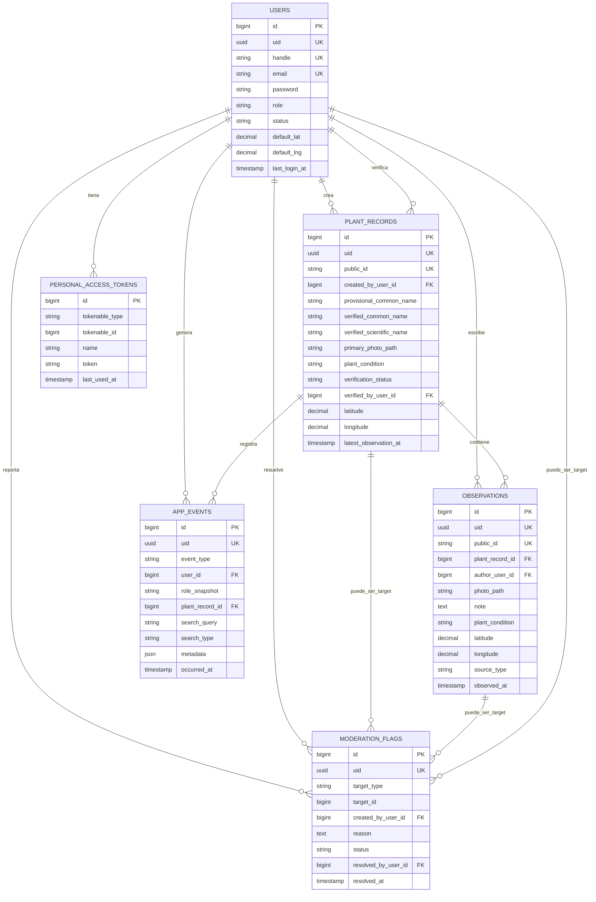
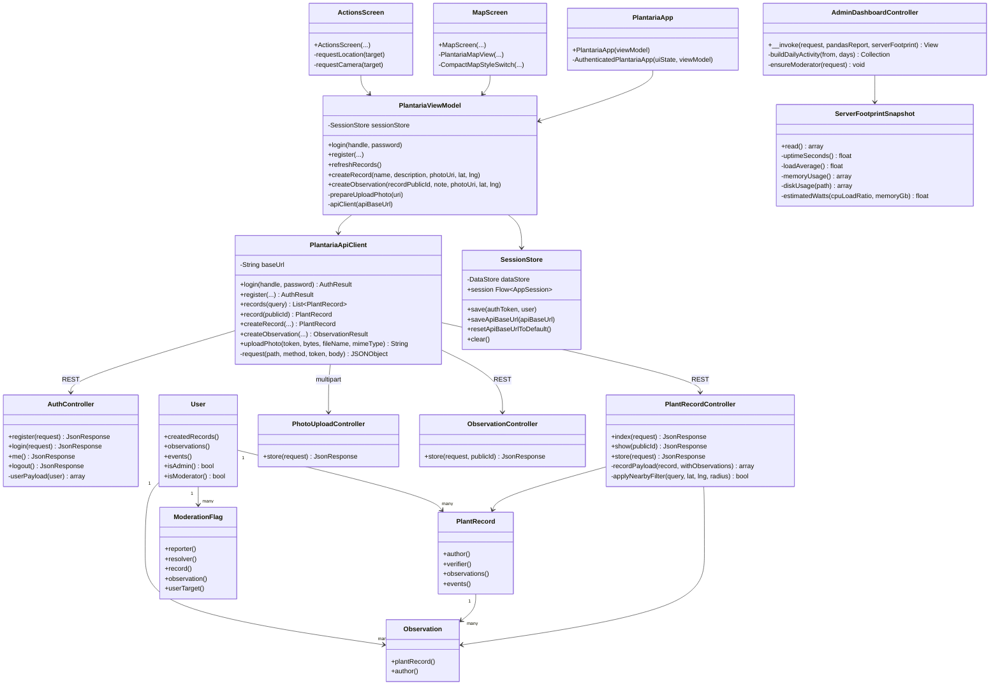

# Guía de presentación y defensa de Plantaria

Duración total orientativa: 15 minutos.

- Bloque 1: 1,5 min. Presentación personal y del proyecto. Puede llevar PowerPoint.
- Bloque 2: 6 min. Programa funcionando como usuario. Cero PowerPoint.
- Bloque 3: 6 min. Show me the code. Cero PowerPoint.
- Bloque 4: 1,5 min. Cierre, resumen y paso a preguntas. Puede llevar PowerPoint.

La idea general es enseñar primero valor funcional, después criterio técnico. No empieces por el código: primero deja claro qué problema resuelve y que el producto funciona.

## Preparación previa

Antes de entrar, deja preparado:

- Móvil con la app Plantaria instalada y sesión cerrada o sesión de demo lista.
- Panel web abierto en `https://api.dlimachii.com/admin`, si el VPS sigue activo.
- Navegador con pestañas preparadas: dashboard, moderación, usuarios o flags.
- IDE abierto en `TFG/Codigo`.
- Terminal preparada, pero no dependas de ejecutar comandos largos en directo.
- Imagen de planta preparada en el móvil por si falla la cámara o la ubicación.
- Credenciales demo/admin a mano en privado, nunca en pantalla pública si son reales.
- Una ruta de emergencia: si internet falla, enseña capturas o explica que la build apunta a producción y abre el código.

## Bloque 1: presentación y proyecto, 1,5 minutos

Objetivo: que entiendan en 90 segundos qué es Plantaria, por qué existe y qué partes tiene.

Puedes usar 1 o 2 diapositivas máximo:

1. Título: `Plantaria`.
2. Subtítulo: app Android para registrar plantas geolocalizadas con backend, panel de administración, moderación, analítica y huella digital del servidor.
3. Tecnologías en una línea: Android Kotlin + Jetpack Compose, Laravel, PostgreSQL/PostGIS, MapLibre/OpenStreetMap, Python/pandas, VPS.

Guion posible:

> Soy David Adrián Limachi Pérez y presento Plantaria, una plataforma para registrar plantas geolocalizadas desde una aplicación Android. El usuario puede consultar un mapa, crear reportes con foto y ubicación, añadir observaciones y ver su actividad. Por detrás hay un backend Laravel con API REST, autenticación, base de datos PostgreSQL/PostGIS, panel de administración, moderación, analítica y una estimación de huella digital del servidor.
>
> La idea no era hacer solo una app visual, sino una solución completa cliente-servidor: móvil, API, datos, mapas, fotos, roles, despliegue y documentación. En la demo voy a enseñar primero cómo se usa como usuario y después entraré al código para justificar arquitectura, estructura y decisiones técnicas.

Qué debes transmitir:

- Es una plataforma conectada, no una app local suelta.
- Tiene parte móvil y parte web.
- La geolocalización es central.
- Hay control de calidad mediante moderación.
- El proyecto está pensado como entrega final reproducible.

Qué evitar:

- No enumeres 20 tecnologías sin explicar para qué sirven.
- No empieces hablando de carpetas.
- No prometas que es un producto comercial acabado: dilo como TFG funcional y ampliable.

## Bloque 2: programa funcionando, 6 minutos, cero PowerPoint

Objetivo: que vean Plantaria como la usaría una persona real. Aquí manda el flujo, no el código.

### Orden recomendado

| Tiempo | Qué enseñas | Qué dices |
|---:|---|---|
| 0:00-0:40 | App Android: splash/login o sesión ya iniciada | "La app se conecta a la API de producción. El login devuelve un token y desde ahí consume rutas autenticadas." |
| 0:40-1:40 | Pestaña `Mapa` | "La pantalla principal es el mapa porque el dato importante es geográfico. Los registros se pintan como marcadores y se pueden filtrar o buscar." |
| 1:40-2:20 | Selector de vista de mapa | "Añadí una alternativa de vista de mapa para no depender de una única visualización y mejorar la legibilidad según el caso." |
| 2:20-3:00 | Detalle de un registro | "Un registro tiene foto, coordenadas, estado, autor y observaciones. El detalle permite entender la evolución de esa planta." |
| 3:00-4:00 | Pestaña `Acciones`: crear reporte | "El usuario aporta información con foto, nombre provisional y ubicación. La app primero prepara/sube la foto y luego crea el registro." |
| 4:00-4:35 | Pestaña `Usuario`: perfil y actividad | "La actividad muestra lo que ha hecho esa cuenta, no todos los datos del sistema. Esto da trazabilidad." |
| 4:35-5:40 | Panel admin web | "Desde web se revisa la operación: métricas, moderación, usuarios, flags, analítica y huella digital del servidor." |
| 5:40-6:00 | Volver al móvil o refrescar | "La app y el panel comparten backend. Lo que se crea desde móvil queda disponible para administración y revisión." |

### Flujo móvil concreto

1. Abre la app.
2. Enseña que se llama `Plantaria`.
3. Si estás en login:
   - Muestra servidor configurado.
   - Inicia sesión con usuario demo.
   - No escribas lento si hay poco tiempo: ten credenciales copiadas.
4. Entra en `Mapa`.
5. Enseña marcadores.
6. Cambia entre `OSM estándar` y `Mapa actual`.
7. Usa búsqueda o filtro si responde rápido.
8. Pulsa un marcador.
9. Abre detalle.
10. Pulsa "añadir observación" si quieres enlazar con `Acciones`.
11. En `Acciones`, enseña:
    - nuevo reporte;
    - foto;
    - latitud/longitud;
    - botón de ubicación actual;
    - creación de reporte.
12. En `Usuario`, enseña:
    - handle;
    - rol;
    - actividad reciente;
    - cierre de sesión si sobra tiempo.

Consejo práctico: si la ubicación o cámara pueden fallar, no te la juegues. Puedes decir:

> Para no depender del GPS de la sala, tengo una imagen y coordenadas preparadas. El flujo real permite usar ubicación actual, pero aquí voy a usar datos controlados para que la demo sea estable.

### Flujo web concreto

En el panel admin enseña solo lo que aporte:

1. Dashboard:
   - registros pendientes/verificados/rechazados;
   - usuarios activos;
   - actividad;
   - huella digital con CPU/memoria/disco/CO2.
2. Moderación:
   - cola de pendientes;
   - detalle de un registro;
   - verificar/rechazar.
3. Flags:
   - denuncias o revisión de contenido.
4. Usuarios:
   - roles y estado.

No dediques demasiado a formularios internos. Lo importante es demostrar que hay un sistema de operación detrás de la app.

Frase para conectar móvil y web:

> Aquí se ve la decisión cliente-servidor: Android no guarda el sistema por su cuenta, sino que manda datos a Laravel; Laravel valida, persiste y luego el panel permite moderar y analizar esos datos.

## Bloque 3: show me the code, 6 minutos, cero PowerPoint

Objetivo: justificar arquitectura, estructura, jerarquía, diseño y decisiones críticas con archivos reales. No abras 40 archivos: abre 8-10 piezas clave y explica por qué existen.

### Pestañas que deberías dejar abiertas

1. `TFG/Codigo/README.md`
2. `TFG/Codigo/backend/routes/api.php`
3. `TFG/Codigo/backend/routes/web.php`
4. `TFG/Codigo/backend/database/migrations/2026_04_20_180424_create_plant_records_table.php`
5. `TFG/Codigo/backend/database/migrations/2026_04_20_180425_create_observations_table.php`
6. `TFG/Codigo/backend/app/Models/PlantRecord.php`
7. `TFG/Codigo/backend/app/Http/Controllers/Api/PlantRecordController.php`
8. `TFG/Codigo/android/app/src/main/java/com/plantaria/app/ui/state/PlantariaViewModel.kt`
9. `TFG/Codigo/android/app/src/main/java/com/plantaria/app/data/api/PlantariaApiClient.kt`
10. `TFG/Codigo/android/app/src/main/java/com/plantaria/app/ui/screens/MapScreen.kt`
11. `TFG/Codigo/backend/app/Services/ServerFootprintSnapshot.php`
12. `TFG/Codigo/backend/resources/views/admin/dashboard.blade.php`

### Guion técnico por minutos

| Tiempo | Archivo | Líneas | Qué explicar |
|---:|---|---:|---|
| 0:00-0:30 | `README.md` | inicio | Estructura general: Android, backend, analytics, scripts, docs, deploy. |
| 0:30-1:05 | `backend/routes/api.php` | 16-58 | Contrato API: públicas, autenticadas, admin; `auth:sanctum` y `active.user`. |
| 1:05-1:25 | `backend/routes/web.php` | 18-45 | Panel web separado de la API: login admin, dashboard, moderación, usuarios. |
| 1:25-2:00 | migraciones | ver abajo | Modelo de datos: usuarios, registros, observaciones, flags, eventos. |
| 2:00-2:35 | `PlantRecordController.php` | 23-101, 118-158 | Listado, filtros, creación transaccional de registro + observación inicial. |
| 2:35-3:00 | `PlantRecordController.php` | 212-238 | PostGIS: radio geográfico con `ST_DWithin` y `ST_Distance`; fallback fuera de PostgreSQL. |
| 3:00-3:40 | `PlantariaViewModel.kt` | 429-495, 497-560 | Flujo Android: valida formulario, prepara foto, sube foto, crea registro u observación. |
| 3:40-4:15 | `PlantariaApiClient.kt` | 157-181, 221-307 | Cliente HTTP: endpoints, token Bearer, JSON y multipart para fotos. |
| 4:15-4:50 | `MapScreen.kt` | 189-200, 237-245, 365-397, 572-599 | MapLibre, estilos de mapa, selector, render de registros. |
| 4:50-5:25 | `build.gradle.kts` | 13-24, 53-79, 99-117 | Variante `prod`, API producción, selector de mapa y dependencias. |
| 5:25-6:00 | `ServerFootprintSnapshot.php` + dashboard | 27-59, 164-172; Blade 133-199 | Huella digital: recursos del servidor, energía estimada, CO2 y visualización admin. |

### Líneas concretas útiles

Backend API:

- `backend/routes/api.php:16-24`: rutas públicas: auth, registros, perfiles, geocoding.
- `backend/routes/api.php:26-37`: rutas autenticadas con Sanctum y usuario activo.
- `backend/routes/api.php:39-58`: rutas admin de analítica, moderación y usuarios.
- `backend/routes/web.php:23-45`: panel web bajo `/admin`.
- `backend/app/Providers/AppServiceProvider.php:25-43`: rate limiting por tipo de ruta.

Autenticación:

- `backend/app/Http/Controllers/Api/AuthController.php:18-42`: registro y creación de token.
- `backend/app/Http/Controllers/Api/AuthController.php:45-76`: login, bloqueo de usuario y token.
- `backend/app/Http/Middleware/EnsureActiveUser.php:15-21`: un usuario baneado no puede seguir usando tokens viejos.
- `backend/app/Models/User.php:56-65`: password hasheada y enums de rol/estado.
- `backend/app/Models/User.php:83-91`: `isAdmin()` e `isModerator()`.

Base de datos:

- `0001_01_01_000000_create_users_table.php:16-41`: usuarios, rol, estado, ubicación por defecto.
- `2026_04_20_180424_create_plant_records_table.php:16-38`: registros de plantas.
- `2026_04_20_180425_create_observations_table.php:16-32`: observaciones asociadas a registros.
- `2026_04_20_180426_create_moderation_flags_table.php:16-30`: flags de moderación.
- `2026_04_20_180427_create_app_events_table.php:14-29`: eventos para actividad y analítica.

Modelos y relaciones:

- `backend/app/Models/PlantRecord.php:35-40`: generación automática de UUID/ULID.
- `backend/app/Models/PlantRecord.php:53-70`: autor, verificador, observaciones y eventos.
- `backend/app/Models/Observation.php:44-52`: observación pertenece a registro y usuario.
- `backend/app/Models/ModerationFlag.php:41-64`: reporter, resolver y posibles targets.
- `backend/app/Models/AppEvent.php:42-59`: registro centralizado de eventos.

Registros, fotos y geografía:

- `backend/app/Http/Controllers/Api/PlantRecordController.php:23-101`: listado con filtros por estado, búsqueda y radio.
- `backend/app/Http/Controllers/Api/PlantRecordController.php:118-158`: creación de registro y observación inicial en transacción.
- `backend/app/Http/Controllers/Api/PlantRecordController.php:160-210`: payload JSON que consume Android.
- `backend/app/Http/Controllers/Api/PlantRecordController.php:212-238`: PostGIS y fallback de distancia.
- `backend/app/Http/Controllers/Api/PhotoUploadController.php:11-24`: subida de fotos al disco público.
- `backend/app/Http/Controllers/Api/ObservationController.php:17-55`: actualización temporal de un registro con observación.

Moderación:

- `backend/app/Http/Controllers/Web/ModerationPanelController.php:22-59`: cola de pendientes y filtros.
- `backend/app/Http/Controllers/Web/ModerationPanelController.php:62-111`: detalle con observaciones, flags y eventos.
- `backend/app/Http/Controllers/Web/ModerationPanelController.php:160-197`: verificación de registro.
- `backend/app/Http/Controllers/Web/ModerationPanelController.php:199-234`: rechazo.
- `backend/app/Http/Controllers/Api/FlagController.php:20-60`: creación de denuncias desde API.

Analítica y dashboard:

- `backend/routes/console.php:13-21`: comando `plantaria:analytics:build`.
- `backend/routes/console.php:48-121`: exportación CSV de usuarios, registros, observaciones, flags y eventos.
- `backend/routes/console.php:142-151`: ejecución del script Python/pandas.
- `analytics/build_admin_analytics.py:46-73`: actividad diaria.
- `analytics/build_admin_analytics.py:76-97`: búsquedas principales.
- `analytics/build_admin_analytics.py:100-137`: usuarios con más contribuciones.
- `backend/app/Http/Controllers/Web/AdminDashboardController.php:26-94`: el dashboard junta métricas, pandas y huella.
- `backend/resources/views/admin/dashboard.blade.php:133-199`: vista de huella digital.

Android:

- `android/app/build.gradle.kts:13-24`: flavor `prod`, nombre Plantaria, selector de mapa, API producción.
- `android/app/build.gradle.kts:53-79`: configuración común, URL base, estilo MapLibre y flags.
- `android/app/build.gradle.kts:99-117`: dependencias clave: Compose, DataStore, Navigation, MapLibre, Dokka.
- `android/app/src/main/java/com/plantaria/app/ui/PlantariaApp.kt:48-84`: decide entre splash, login y app autenticada.
- `android/app/src/main/java/com/plantaria/app/ui/PlantariaApp.kt:108-229`: navegación inferior `Mapa`, `Acciones`, `Usuario`.
- `android/app/src/main/java/com/plantaria/app/data/session/SessionStore.kt:20-55`: sesión persistida con DataStore.
- `android/app/src/main/java/com/plantaria/app/data/session/SessionStore.kt:80-98`: cambio/restablecimiento de servidor limpiando sesión.
- `android/app/src/main/java/com/plantaria/app/ui/state/PlantariaViewModel.kt:40-85`: estado central y carga inicial.
- `android/app/src/main/java/com/plantaria/app/ui/state/PlantariaViewModel.kt:101-122`: reseteo de URLs locales antiguas.
- `android/app/src/main/java/com/plantaria/app/ui/state/PlantariaViewModel.kt:429-495`: crear reporte.
- `android/app/src/main/java/com/plantaria/app/ui/state/PlantariaViewModel.kt:497-560`: crear observación.
- `android/app/src/main/java/com/plantaria/app/ui/state/PlantariaViewModel.kt:598-615`: refresco de registros.
- `android/app/src/main/java/com/plantaria/app/ui/state/PlantariaViewModel.kt:712-734`: preparación/compresión de foto.
- `android/app/src/main/java/com/plantaria/app/data/api/PlantariaApiClient.kt:31-110`: login, registro, sesión y actividad.
- `android/app/src/main/java/com/plantaria/app/data/api/PlantariaApiClient.kt:113-155`: registros y geocodificación.
- `android/app/src/main/java/com/plantaria/app/data/api/PlantariaApiClient.kt:157-219`: crear registro y observación.
- `android/app/src/main/java/com/plantaria/app/data/api/PlantariaApiClient.kt:221-266`: subida multipart de foto.
- `android/app/src/main/java/com/plantaria/app/data/api/PlantariaApiClient.kt:268-307`: request genérico con JSON y token Bearer.
- `android/app/src/main/java/com/plantaria/app/ui/screens/ActionsScreen.kt:149-204`: ubicación y permisos.
- `android/app/src/main/java/com/plantaria/app/ui/screens/ActionsScreen.kt:206-267`: cámara y Photo Picker.
- `android/app/src/main/java/com/plantaria/app/ui/screens/ActionsScreen.kt:286-435`: formulario de nuevo reporte.
- `android/app/src/main/java/com/plantaria/app/ui/screens/ActionsScreen.kt:438-592`: formulario de observación.
- `android/app/src/main/java/com/plantaria/app/ui/screens/MapScreen.kt:121-146`: estilo OSM estándar embebido.
- `android/app/src/main/java/com/plantaria/app/ui/screens/MapScreen.kt:189-200`: enum de estilos de mapa.
- `android/app/src/main/java/com/plantaria/app/ui/screens/MapScreen.kt:237-245`: estilo inicial según build.
- `android/app/src/main/java/com/plantaria/app/ui/screens/MapScreen.kt:365-397`: mapa y switch compacto.
- `android/app/src/main/java/com/plantaria/app/ui/screens/MapScreen.kt:483-600`: integración `MapView` en Compose y render tras cargar estilo.
- `android/app/src/main/java/com/plantaria/app/ui/screens/UserScreen.kt:56-94`: perfil y actividad.

### Frases útiles para el código

Arquitectura:

> Separé Android, backend, analítica y despliegue porque cada capa tiene una responsabilidad distinta. Android no conoce la base de datos: solo consume un contrato HTTP. Laravel valida y decide, PostgreSQL/PostGIS persiste y calcula distancia, y el panel administra el sistema.

API:

> Aquí se ve el contrato real de la aplicación. Las rutas públicas permiten consultar datos y autenticarse; las rutas protegidas exigen token Sanctum y además pasan por `active.user`, para que una cuenta bloqueada no conserve acceso.

Base de datos:

> El modelo no guarda solo plantas. Guarda usuarios, registros, observaciones, flags y eventos. Así puedo representar autoría, evolución temporal, moderación y actividad para analítica.

PostGIS:

> Como el núcleo del proyecto es geográfico, no quería tratar latitud y longitud solo como dos números. Con PostGIS puedo filtrar por radio y calcular distancias de forma más correcta.

Android:

> El ViewModel concentra el estado y las acciones. La pantalla no llama directamente a endpoints sueltos, sino que delega en el ViewModel, y este usa el cliente API. Así la UI queda más separada de red y persistencia.

Fotos:

> La foto se sube primero y el backend devuelve una ruta. Después esa ruta se usa al crear el registro u observación. Separarlo simplifica errores: si falla la imagen no se crea un reporte a medias.

Mapa:

> MapLibre está integrado dentro de Compose mediante `AndroidView`, porque MapLibre proporciona una vista nativa. El selector de estilo permite cambiar de base sin tocar la lógica del mapa.

Huella:

> La huella no la presento como medición certificada, sino como estimación orientativa. La puse porque el proyecto trata medio ambiente y quería que la propia infraestructura también tuviera una lectura de recursos.

## Bloque 4: cierre, 1,5 minutos

Objetivo: cerrar con seguridad y dejar preparada la fase de preguntas.

Guion posible:

> Para cerrar, Plantaria cumple el objetivo principal: una app Android funcional conectada a un backend real, con registro de plantas geolocalizadas, fotos, observaciones, panel de administración, moderación, analítica y seguimiento de recursos del servidor.
>
> Técnicamente, el proyecto me ha permitido trabajar una arquitectura completa: Kotlin y Compose en móvil, Laravel y Sanctum en backend, PostgreSQL/PostGIS para datos geográficos, MapLibre/OpenStreetMap para mapas, Python/pandas para analítica y despliegue en VPS.
>
> Si tuviera más tiempo, evolucionaría la identificación de especies, modo offline parcial, notificaciones, monitorización más avanzada y un proceso legal completo para producción pública. Con esto termino la demo y quedo a vuestra disposición para preguntas.

Qué debes remarcar:

- Funciona como sistema completo.
- Hay decisiones justificadas.
- Sabes limitaciones y mejoras futuras.
- No vendes humo: dices qué es real y qué sería evolución.

## Mapa conceptual de base de datos

Tablas de dominio principales:

- `users`: usuarios de la plataforma, con rol (`user`, `mod`, `admin`) y estado (`active`, `banned`, etc.).
- `plant_records`: registros principales de plantas.
- `observations`: observaciones temporales asociadas a un registro.
- `moderation_flags`: denuncias o incidencias sobre registros, observaciones o usuarios.
- `app_events`: eventos de actividad para historial y analítica.
- `personal_access_tokens`: tokens de Sanctum para autenticación móvil.

Cardinalidades principales:

- Un `user` crea muchos `plant_records`.
- Un `plant_record` pertenece a un `user` autor.
- Un `plant_record` puede ser verificado por cero o un `user` moderador/admin.
- Un `user` puede verificar muchos `plant_records`.
- Un `plant_record` tiene muchas `observations`.
- Una `observation` pertenece a un `plant_record`.
- Un `user` crea muchas `observations`.
- Una `observation` pertenece a un `user` autor.
- Un `user` crea muchos `moderation_flags`.
- Un `moderation_flag` pertenece al `user` que lo crea.
- Un `moderation_flag` puede estar resuelto por cero o un `user`.
- Un `moderation_flag` apunta a un target: registro, observación o usuario. En la base se modela con `target_type` + `target_id`.
- Un `user` genera muchos `app_events`.
- Un `plant_record` puede tener muchos `app_events`.
- Un `personal_access_token` pertenece polimórficamente a un usuario mediante Sanctum.

Diagrama ER en Mermaid:



Nota para explicarlo:

> La relación más importante es usuario-registro-observación. Un usuario crea un registro y ese registro puede acumular observaciones. Aparte está moderación, que puede apuntar a varios tipos de objetivo, y eventos, que guardan actividad para trazabilidad y analítica.

## Mapa conceptual de arquitectura

Diagrama textual:

```text
Usuario móvil
    |
    | Android Kotlin + Jetpack Compose
    | MapLibre + OpenStreetMap
    | DataStore para sesión
    v
HTTPS / JSON / REST
    |
    v
Laravel API
    |-- AuthController + Sanctum
    |-- PlantRecordController
    |-- ObservationController
    |-- PhotoUploadController
    |-- FlagController
    |-- FormRequest + Middleware + Rate Limiting
    |
    | SQL + PostGIS
    v
PostgreSQL/PostGIS
    |
    | CSV export
    v
Python/pandas analytics --> admin_dashboard.json

Administrador web
    |
    | Laravel Blade /admin
    v
Dashboard + moderación + usuarios + flags + huella digital

Infraestructura
    |
    v
VPS + HTTPS + dominio api.dlimachii.com
```

## Prompt para generar imagen de arquitectura

Puedes pegar este prompt en ChatGPT con generación de imagen o en otra herramienta visual:

```text
Crea un diagrama técnico limpio y profesional, estilo arquitectura software, para un proyecto llamado "Plantaria".

Debe tener estos bloques:

1. A la izquierda: "App Android" con icono de móvil. Debajo: Kotlin, Jetpack Compose, MapLibre, OpenStreetMap, DataStore.
2. Desde Android sale una flecha hacia el centro con etiqueta "HTTPS + JSON + API REST".
3. En el centro: "Backend Laravel" con subbloques: API REST, Laravel Sanctum, FormRequest validation, Middleware active.user, Rate limiting, Controllers.
4. Debajo del backend: "PostgreSQL + PostGIS" con flecha bidireccional SQL. Indicar: users, plant_records, observations, moderation_flags, app_events.
5. A la derecha: "Panel Admin Web /admin" con subbloques: dashboard, moderación, usuarios, flags, asistente SQL solo lectura, huella digital.
6. Del backend hacia "Storage público Laravel" con etiqueta "fotos de plantas".
7. Del backend hacia "Python + pandas analytics" con etiqueta "export CSV -> admin_dashboard.json".
8. Arriba o abajo: "VPS producción" con dominio "https://api.dlimachii.com", HTTPS, Nginx/Caddy.
9. Añadir servicios externos: OpenStreetMap/MapLibre tiles y Nominatim/geocoding como servicios consultados para mapas y búsquedas.

Estilo visual: fondo claro, colores verdes y azules suaves, flechas claras, sin exceso de texto, aspecto de presentación universitaria. Debe quedar horizontal, legible en una diapositiva 16:9. Añade pequeñas etiquetas de protocolo en las flechas: REST, JSON, SQL, CSV, HTTPS.
```

## Prompt para generar imagen del modelo de base de datos

```text
Crea un diagrama entidad-relación profesional para la base de datos de "Plantaria".

Entidades principales:

USERS:
- id PK
- uid
- handle
- email
- password
- role
- status
- default_lat
- default_lng
- last_login_at

PLANT_RECORDS:
- id PK
- public_id
- created_by_user_id FK -> users.id
- verified_by_user_id FK nullable -> users.id
- provisional_common_name
- verified_common_name
- verified_scientific_name
- primary_photo_path
- plant_condition
- verification_status
- latitude
- longitude
- latest_observation_at

OBSERVATIONS:
- id PK
- public_id
- plant_record_id FK -> plant_records.id
- author_user_id FK -> users.id
- photo_path
- note
- plant_condition
- latitude
- longitude
- source_type
- observed_at

MODERATION_FLAGS:
- id PK
- uid
- target_type
- target_id
- created_by_user_id FK -> users.id
- resolved_by_user_id FK nullable -> users.id
- reason
- status
- resolved_at

APP_EVENTS:
- id PK
- uid
- event_type
- user_id FK nullable -> users.id
- plant_record_id FK nullable -> plant_records.id
- role_snapshot
- search_query
- search_type
- metadata
- occurred_at

PERSONAL_ACCESS_TOKENS:
- id PK
- tokenable_type
- tokenable_id
- name
- token
- last_used_at

Cardinalidades:
- users 1:N plant_records como autor
- users 1:N plant_records como verificador opcional
- plant_records 1:N observations
- users 1:N observations
- users 1:N moderation_flags como creador
- users 1:N moderation_flags como resolvedor opcional
- moderation_flags apunta de forma polimórfica a plant_records, observations o users mediante target_type + target_id
- users 1:N app_events
- plant_records 1:N app_events
- users 1:N personal_access_tokens mediante Sanctum

Estilo: ERD claro, profesional, con crow's foot notation, fondo blanco, entidades en cajas, claves primarias y foráneas visibles, flechas con 1:N, colores verdes suaves por temática ambiental.
```

## Diagrama tipo clases/UML para enseñar estructura de código

Esto es lo que comentabas de Java: un diagrama de clases muestra clases, atributos/métodos, visibilidad y relaciones. En tu caso no sería solo `.java`, sino mezcla de Kotlin y PHP.

Conviene hacerlo resumido, no con todas las funciones reales, porque si metes todo quedará ilegible.

Diagrama de clases conceptual en Mermaid:



## Prompt para generar imagen UML/clases

```text
Crea un diagrama UML de clases resumido para el proyecto "Plantaria", con dos zonas visuales: Android Kotlin y Backend Laravel.

Zona Android Kotlin:
- PlantariaApp
  + PlantariaApp(viewModel)
  - AuthenticatedPlantariaApp(uiState, viewModel)
- PlantariaViewModel
  - sessionStore: SessionStore
  + login(handle: String, password: String)
  + register(...)
  + refreshRecords()
  + createRecord(name: String, description: String, photoUri: Uri, lat: String, lng: String)
  + createObservation(recordPublicId: String, note: String, photoUri: Uri, lat: String, lng: String)
  - prepareUploadPhoto(uri: Uri): SelectedPhoto
  - apiClient(apiBaseUrl: String): PlantariaApiClient
- PlantariaApiClient
  - baseUrl: String
  + login(...): AuthResult
  + records(query: String?): List<PlantRecord>
  + createRecord(...): PlantRecord
  + createObservation(...): ObservationResult
  + uploadPhoto(...): String
  - request(...): JSONObject
- SessionStore
  + session: Flow<AppSession>
  + save(authToken, user)
  + saveApiBaseUrl(apiBaseUrl)
  + clear()
- MapScreen
- ActionsScreen
- UserScreen

Zona Backend Laravel:
- AuthController
  + register(request): JsonResponse
  + login(request): JsonResponse
  + me(): JsonResponse
  + logout(): JsonResponse
- PlantRecordController
  + index(request): JsonResponse
  + show(publicId): JsonResponse
  + store(request): JsonResponse
  - applyNearbyFilter(...): bool
- PhotoUploadController
  + store(request): JsonResponse
- ObservationController
  + store(request, publicId): JsonResponse
- AdminDashboardController
  + __invoke(...): View
- ServerFootprintSnapshot
  + read(): array
  - memoryUsage(): array
  - diskUsage(path): array
  - estimatedWatts(...): float
- Models: User, PlantRecord, Observation, ModerationFlag, AppEvent

Relaciones:
- PlantariaApp usa PlantariaViewModel.
- PlantariaViewModel usa SessionStore y PlantariaApiClient.
- PlantariaApiClient llama por REST a los controladores Laravel.
- PlantRecordController usa PlantRecord y Observation.
- AdminDashboardController usa ServerFootprintSnapshot.
- User 1:N PlantRecord.
- PlantRecord 1:N Observation.
- User 1:N Observation.
- User 1:N ModerationFlag.
- AppEvent registra actividad de User y PlantRecord.

Usa notación UML con + público, - privado, flechas de dependencia y asociación, estilo limpio, legible, horizontal 16:9, colores suaves, separar Android y Backend con dos columnas.
```

## Qué preguntas pueden salir justo después de enseñar esto

- ¿Por qué no hiciste una app offline?
- ¿Por qué Laravel y no Firebase?
- ¿Qué aporta PostGIS frente a guardar coordenadas normales?
- ¿Por qué Sanctum y no sesiones?
- ¿Qué pasa si un usuario sube datos falsos?
- ¿Qué datos no has subido a GitHub?
- ¿Cómo escalaría el sistema?
- ¿La huella de carbono es exacta?
- ¿Qué parte cambiarías si lo hicieras de nuevo?
- ¿Cómo probarías que el sistema funciona?

Respuesta corta tipo:

> La decisión fue construir una arquitectura realista pero controlada. No usé Firebase porque quería demostrar backend propio, reglas de negocio, panel admin, base de datos relacional y consultas geográficas. Plantaria no pretende ser una plataforma científica certificada, pero sí una base funcional y ampliable con criterios de seguridad, moderación y mantenibilidad.

## Plan B si algo falla en directo

Si falla internet:

- Enseña app instalada y explica que la build apunta a producción.
- Abre código de `build.gradle.kts:15-23`.
- Abre `PlantariaApiClient.kt:268-307` para enseñar cómo llamaría a la API.
- Abre capturas si tienes.

Si falla el login:

- Enseña `AuthController.php:45-76`.
- Enseña `SessionStore.kt:20-55`.
- Di que el flujo real es token Bearer con Sanctum.

Si falla el mapa:

- Enseña `MapScreen.kt:189-200` y `MapScreen.kt:483-600`.
- Di que MapLibre se integra como vista nativa dentro de Compose.

Si falla crear reporte:

- Enseña `ActionsScreen.kt:286-435`.
- Enseña `PlantariaViewModel.kt:429-495`.
- Enseña `PhotoUploadController.php:11-24` y `PlantRecordController.php:118-158`.

Si no hay tiempo para código:

- Enseña rutas API.
- Enseña migraciones.
- Enseña ViewModel + ApiClient.
- Enseña PostGIS.
- Enseña huella digital.

Con eso ya demuestras arquitectura, datos, móvil, backend y criterio.
