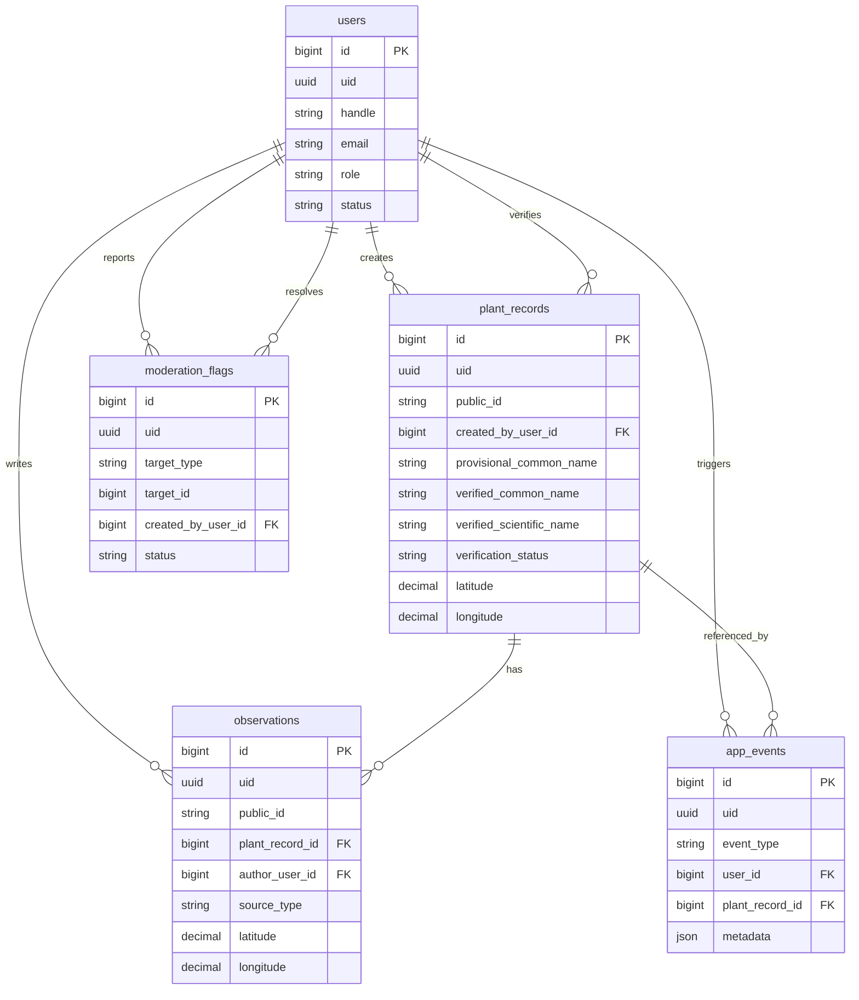
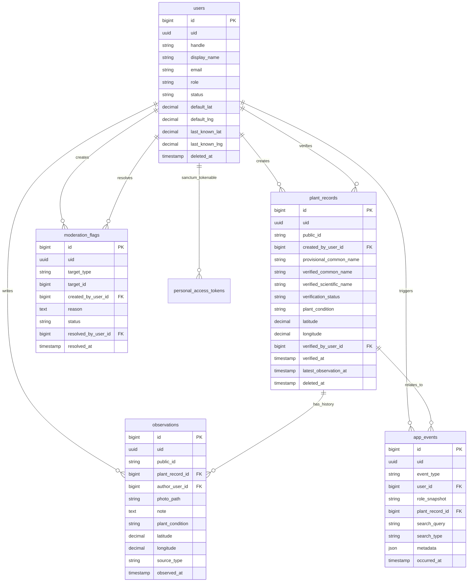

# Contexto completo del proyecto Plantaria

Fecha de analisis: 2026-05-12  
Repositorio local analizado: `/home/aviddrianimachie/CEAC/Proyecto`  
Servidor revisado por SSH: `root@161.35.204.224`  
API publica observada en VPS: `https://api.dlimachii.com`  

Este documento resume el estado real del proyecto a partir del codigo fuente local, la documentacion existente, la carpeta historica local `Contexto/` restaurada desde Git y la configuracion viva del servidor. Esta pensado para que otra IA pueda entender Plantaria sin ver el repositorio original.

Fuentes usadas en esta revision:

- Codigo local en `/home/aviddrianimachie/CEAC/Proyecto`.
- Documentacion viva en `README.md`, `docs/`, `android/README.md` y `backend/README.md`.
- Contexto historico recuperado en `Contexto/`.
- Backend/API/BBDD reales del VPS revisados por SSH en `root@161.35.204.224`.
- Validaciones locales ejecutadas durante la revision: `php artisan test` y build Android `:app:assembleProdDebug`.

## 0. Avisos importantes de coherencia

El proyecto tiene dos fuentes de verdad actuales:

- La parte Android vive en este workspace local, dentro de `android/`.
- La parte servidor/API/base de datos existe tambien localmente en `backend/`, pero el estado desplegado real se ha comprobado en el VPS en `/var/www/Plantaria/backend`.

Hay una discrepancia relevante sobre Row Level Security:

- En conversaciones/notas recientes se menciona RLS como algo que se queria incorporar.
- En el codigo local no existe migracion ni servicio que active RLS nativo de PostgreSQL.
- En el VPS se ha consultado `pg_class` y `pg_policies`; todas las tablas aparecen con `relrowsecurity = false` y no hay politicas en `pg_policies`.
- La memoria existente `docs/MEMORIA_TFC.md` dice explicitamente que no se ha implantado todavia RLS real en PostgreSQL.

Por tanto, para documentacion academica honesta:

- CORS, variables de entorno, rate limiting, saneado de inputs, middleware de cuenta activa y SQL administrativo de solo lectura SI estan implementados.
- RLS nativo en PostgreSQL NO esta activo en el estado observado el 2026-05-11. Si se quiere defender RLS como funcionalidad final, falta anadir una migracion/politicas y aplicarlas en el VPS.

## 1. Resumen general

### Objetivo del proyecto

Plantaria es un Trabajo Final de Ciclo de DAM orientado a una plataforma colaborativa de plantas geolocalizadas. El objetivo es permitir que usuarios registren plantas reales en un mapa mediante foto, ubicacion, descripcion y nombre provisional, y que despues la comunidad pueda hacer seguimiento temporal mediante nuevas observaciones.

El sistema anade una capa de moderacion para que moderadores o administradores validen la informacion botanica: nombre comun verificado, nombre cientifico y estado de verificacion. La idea funcional se ha descrito como un "GitHub de plantas", no en el sentido tecnico de control de versiones de codigo, sino como trazabilidad comunitaria: un registro inicial, contribuciones posteriores y validacion.

### Problema que resuelve

Plantaria resuelve varios problemas en un unico flujo:

- Registrar vegetacion observada en el entorno real con coordenadas y foto.
- Evitar que las observaciones queden aisladas en una galeria personal; se organizan sobre un mapa compartido.
- Permitir seguimiento temporal de una misma planta o punto botanico mediante observaciones posteriores.
- Diferenciar contenido provisional de contenido verificado.
- Dar herramientas de moderacion para controlar calidad, denuncias y usuarios.
- Generar datos analiticos del uso de la plataforma para administracion y memoria academica.

### Tipo de aplicacion

El producto actual es una aplicacion distribuida con:

- App Android nativa en Kotlin + Jetpack Compose.
- API backend en PHP con Laravel 13.
- Panel web administrativo en Laravel Blade.
- Base de datos PostgreSQL/PostGIS.
- Modulo analitico auxiliar en Python + pandas.
- Despliegue real en VPS con Nginx + PHP-FPM + PostgreSQL local del servidor.
- Plantilla opcional de despliegue Docker/Caddy en `deploy/vps/`.

No es una web publica completa para usuarios finales. La web actual es principalmente panel de administracion/moderacion.

### Estado actual del desarrollo

Estado observado el 2026-05-11:

- Backend local: Laravel Framework 13.5.0, PHP 8.3.6.
- Backend local: `php artisan test` pasa con 43 tests y 205 assertions.
- Android local: `./gradlew :app:assembleProdDebug` termina con `BUILD SUCCESSFUL`.
- VPS: Laravel Framework 13.5.0, PHP 8.3.6, Composer 2.9.7, Node 20.20.2, npm 10.8.2.
- VPS: entorno Laravel en `production`, debug desactivado, URL `api.dlimachii.com`.
- VPS: Nginx sirve `/var/www/Plantaria/backend/public` por HTTPS con certificado Let's Encrypt.
- VPS: PostgreSQL 16.13 con PostGIS 3.4.2.
- VPS: base de datos `plantaria` con datos reales/demo: 4 usuarios estimados, 7 registros, 7 observaciones, 29 eventos, 4 tokens, 0 flags.

El MVP esta en fase de estabilizacion/documentacion. El flujo principal ya existe: registro/login, mapa, carga de registros, fotos, creacion de reportes, observaciones, perfil, actividad, moderacion, flags, analitica y despliegue.

## 2. Arquitectura

### Estructura general de carpetas

```text
.
├── android/                 App Android Kotlin + Jetpack Compose
├── backend/                 API Laravel, panel admin, modelos, tests y migraciones
├── analytics/               Scripts Python/pandas para analitica administrativa
├── deploy/vps/              Ejemplo de despliegue Docker Compose + Caddy
├── docs/                    Documentacion tecnica, API, demo, memoria y portal Docsify
├── scripts/                 Utilidades de arranque, validacion, instalacion APK y perfilado
├── compose.yaml             PostgreSQL/PostGIS local para desarrollo
├── README.md                Resumen principal del proyecto
└── contexto_proyecto.md     Este documento
```

### Responsabilidad de cada bloque

`android/`

- Cliente principal de usuario final.
- Gestiona autenticacion, sesion persistida, mapa, reportes, observaciones, fotos, ubicacion y actividad de usuario.
- Consume la API REST Laravel.
- No contiene logica de moderacion administrativa.

`backend/`

- Backend transaccional del producto.
- Expone endpoints REST bajo `/api`.
- Sirve panel admin bajo `/admin`.
- Gestiona autenticacion por Sanctum para Android y sesiones web para administracion.
- Persiste usuarios, registros, observaciones, flags y eventos.
- Valida y sanea entradas.
- Aplica autorizacion por roles.
- Exporta datasets para analitica pandas.

`analytics/`

- Modulo complementario, no parte del flujo transaccional principal.
- Recibe CSV exportados por Laravel.
- Procesa KPIs con pandas.
- Genera `admin_dashboard.json` para el panel.
- Mantiene un script historico `usage_report.py` capaz de conectar directamente a PostgreSQL y producir CSV/PNG.

`deploy/vps/`

- Plantilla alternativa para desplegar con Docker Compose y Caddy.
- No coincide exactamente con el despliegue vivo observado en el VPS actual, que usa Nginx + PHP-FPM + PostgreSQL del sistema.

`scripts/`

- Reduce pasos manuales:
  - arrancar stack movil local;
  - instalar APK en movil;
  - validar backend + Android + smoke PostGIS;
  - perfilar endpoints y APK;
  - servir documentacion.

`docs/`

- Documentacion de entrega y tecnica:
  - `API.md`;
  - `DEPLOY_VPS.md`;
  - `GUIA_DEMO.md`;
  - `CHECKLIST_VALIDACION_MOVIL.md`;
  - `MEMORIA_TFC.md`;
  - `REFERENCIA_TECNICA.md`;
  - portal Docsify.

### Arquitectura logica

Plantaria sigue una arquitectura pragmatica por capas:

```text
Android UI
  ↓
PlantariaViewModel
  ↓
PlantariaApiClient + SessionStore
  ↓ HTTP/JSON
Laravel routes/api.php
  ↓
Controllers API + FormRequest validation
  ↓
Eloquent Models + Services
  ↓
PostgreSQL/PostGIS + storage publico
```

Panel web:

```text
Navegador admin/mod
  ↓
Laravel routes/web.php
  ↓
Controllers Web
  ↓
Blade views
  ↓
Models/Services/PostgreSQL
```

Analitica:

```text
Artisan plantaria:analytics:build
  ↓
Export CSV desde DB
  ↓
analytics/build_admin_analytics.py
  ↓
admin_dashboard.json
  ↓
Dashboard /admin y assistant context
```

### Patrones usados

No hay una Clean Architecture formal con repositorios, casos de uso y entidades puras. El proyecto usa patrones idiomaticos de Laravel y Android:

- Laravel MVC:
  - modelos Eloquent en `backend/app/Models`;
  - controladores en `backend/app/Http/Controllers`;
  - vistas Blade en `backend/resources/views`;
  - rutas en `backend/routes`;
  - validacion en `FormRequest`.
- Service Layer puntual:
  - `AdminReadOnlySqlQuery`;
  - `AdminAssistantDirectQuery`;
  - `PandasAnalyticsReport`.
- MVVM pragmatica en Android:
  - `PlantariaViewModel` concentra estado y casos de uso de UI;
  - pantallas Compose son funciones declarativas;
  - `PlantariaApiClient` es capa de datos HTTP;
  - `SessionStore` es persistencia local de sesion.
- DTO/data classes en Android:
  - `ApiUser`;
  - `PlantRecord`;
  - `PlantObservation`;
  - `UserActivityItem`;
  - `PlaceSearchResult`.

### Flujo general de aplicacion

1. El usuario abre la app Android.
2. `MainActivity` monta `PlantariaTheme` y `PlantariaApp`.
3. `PlantariaApp` muestra splash durante un breve periodo y espera a que `SessionStore` emita sesion.
4. Si no hay token, se muestra `AuthScreen`.
5. Si hay token, se entra a la navegacion autenticada con pestañas:
   - `Mapa`;
   - `Acciones`;
   - `Usuario`.
6. Al autenticarse, `PlantariaViewModel` refresca usuario actual, registros del mapa y actividad propia.
7. El mapa consulta `/api/records`, dibuja marcadores MapLibre y permite abrir fichas.
8. Acciones permite subir fotos y crear reportes/observaciones.
9. Usuario muestra perfil basico, rol, actividad reciente y logout.
10. En paralelo, administradores/moderadores pueden entrar al panel web `/admin`.
11. El panel permite revisar pendientes, verificar/rechazar, gestionar flags, usuarios y analitica.

## 3. Tecnologias

### Lenguajes

- Kotlin: app Android.
- PHP 8.3: backend Laravel.
- SQL/PostgreSQL: persistencia y consultas.
- Python 3.12: analitica pandas.
- JavaScript/CSS: assets web Laravel con Vite/Tailwind.
- Bash/PowerShell: scripts operativos.

### Backend

`backend/composer.json`:

- PHP `^8.3`.
- `laravel/framework`: `^13.0`.
- `laravel/sanctum`: `^4.0`.
- `laravel/tinker`: `^3.0`.
- PHPUnit `^12.5.12`.
- Laravel Pint, Collision, Mockery y Faker en desarrollo.

Versiones observadas:

- Local:
  - Laravel Framework 13.5.0.
  - PHP 8.3.6.
  - Composer 2.7.1.
  - Node 18.19.1.
  - npm 9.2.0.
- VPS:
  - Laravel Framework 13.5.0.
  - PHP 8.3.6.
  - Composer 2.9.7.
  - Node 20.20.2.
  - npm 10.8.2.

### Frontend web administrativo

`backend/package.json`:

- Vite `^8.0.0`.
- Laravel Vite Plugin `^3.0.0`.
- TailwindCSS `^4.0.0`.
- `@tailwindcss/vite`.
- `concurrently`.

El panel web esta renderizado principalmente con Blade. No es una SPA.

### Android

`android/app/build.gradle.kts`:

- Android Gradle Plugin 9.1.1.
- Gradle wrapper 9.3.1.
- Kotlin/Compose plugin 2.3.10.
- Compose BOM 2026.03.00.
- `compileSdk = 36`.
- `targetSdk = 36`.
- `minSdk = 26`.
- `versionName = 0.1.0`.
- `applicationId = com.plantaria.app`.

Dependencias Android principales:

- `androidx.activity:activity-compose:1.13.0`.
- Jetpack Compose Foundation/UI/Material3.
- Material icons extended.
- `androidx.navigation:navigation-compose:2.9.7`.
- `androidx.datastore:datastore-preferences:1.2.1`.
- Lifecycle runtime/viewmodel compose 2.10.0.
- MapLibre Native Android `org.maplibre.gl:android-sdk:13.0.2`.
- Dokka `2.2.0` para documentacion Android.

Product flavors:

- `prod`: app normal `Plantaria`.
- `demoA`, `demoB`, `demoC`: variantes instalables en paralelo con sufijo de applicationId.

BuildConfig relevante:

```kotlin
PLANTARIA_API_BASE_URL = "https://api.dlimachii.com/api/"
PLANTARIA_MAP_STYLE_URL = "https://demotiles.maplibre.org/style.json"
PLANTARIA_BOOTSTRAP_CONFIG_URL = ""
```

Nota: el usuario puede cambiar el servidor desde la pantalla de acceso. La documentacion historica dice que el campo se oculto, pero el codigo actual `AuthScreen.kt` si muestra `Servidor (API)` y boton `Guardar servidor`.

### Base de datos

- Desarrollo local: `compose.yaml` usa `postgis/postgis:16-3.5`.
- VPS real: PostgreSQL 16.13 del sistema Ubuntu, PostGIS 3.4.2.
- Extension PostGIS activada por migracion si el driver es `pgsql`.

### Analitica Python

`analytics/requirements.txt`:

- `pandas>=2.2,<3.0`.
- `matplotlib>=3.8,<4.0`.
- `sqlalchemy>=2.0,<3.0`.
- `psycopg[binary]>=3.1,<4.0`.

### Infraestructura/despliegue

Local:

- Docker/Docker Compose para PostGIS.
- Laravel dev server para API.
- Android Gradle Wrapper para compilar APK.

VPS observado:

- Ubuntu.
- Nginx activo.
- PHP 8.3 FPM activo.
- PostgreSQL 16 activo.
- Docker instalado pero sin contenedores en ejecucion en el momento de la inspeccion.
- API servida en `api.dlimachii.com`.

Plantilla alternativa en repo:

- `deploy/vps/docker-compose.yml`: PostGIS + app Laravel + Caddy.
- `deploy/vps/Caddyfile`: reverse proxy `api.{DOMAIN_NAME}` a `app:8000`.

## 4. Backend / logica

### Rutas API

Archivo: `backend/routes/api.php`

Rutas publicas:

```text
POST /api/auth/register
POST /api/auth/login
GET  /api/records
GET  /api/records/{publicId}
GET  /api/profiles/{handle}
GET  /api/geocoding/search
```

Rutas autenticadas con `auth:sanctum` y `active.user`:

```text
GET    /api/auth/me
POST   /api/auth/logout
GET    /api/me/activity
PATCH  /api/profile
POST   /api/uploads/photos
POST   /api/records
POST   /api/records/{publicId}/observations
POST   /api/flags
```

Rutas administrativas API:

```text
GET    /api/admin/analytics/summary
GET    /api/admin/analytics/trends
GET    /api/admin/analytics/top-searches
GET    /api/admin/moderation/pending
POST   /api/admin/moderation/records/{publicId}/verify
GET    /api/admin/moderation/flags
POST   /api/admin/moderation/flags/{uid}/resolve
GET    /api/admin/users
GET    /api/admin/users/{handle}
PATCH  /api/admin/users/{handle}
POST   /api/admin/users/{handle}/ban
DELETE /api/admin/users/{handle}
```

Control de acceso:

- Las rutas autenticadas requieren token Sanctum.
- `EnsureActiveUser` bloquea cuentas no activas con `403 Cuenta no activa.`.
- Analitica admin y usuarios admin requieren rol `admin`.
- Moderacion/flags requieren `mod` o `admin`.

### Rutas web administrativas

Archivo: `backend/routes/web.php`

```text
GET  /
GET  /login -> redireccion a /admin/login
GET  /admin/login
POST /admin/login
POST /admin/logout
GET  /admin
POST /admin/analytics/rebuild
GET  /admin/assistant
POST /admin/assistant
POST /admin/assistant/sql
GET  /admin/moderation/pending
GET  /admin/moderation/records/{publicId}
POST /admin/moderation/records/{publicId}
POST /admin/moderation/records/{publicId}/verify
POST /admin/moderation/records/{publicId}/reject
GET  /admin/flags
POST /admin/flags/{uid}
GET  /admin/users
GET  /admin/users/{handle}
POST /admin/users/{handle}
```

### Autenticacion API

Archivo: `backend/app/Http/Controllers/Api/AuthController.php`

Registro:

- Usa `RegisterRequest`.
- Crea `User` con rol `UserRole::USER` y estado `UserStatus::ACTIVE`.
- Normaliza `handle` y `email` a minusculas.
- Genera token Sanctum con `createToken`.
- Registra evento `EventType::USER_REGISTERED`.
- Devuelve `token` y `user`.

Login:

- Usa `LoginRequest`.
- Busca por `handle`.
- Verifica password con `Hash::check`.
- Bloquea usuarios `BANNED`.
- Actualiza `last_login_at`, `last_known_lat`, `last_known_lng`.
- Genera token Sanctum.
- Registra evento `USER_LOGGED_IN`.

Logout:

- Elimina el token actual con `currentAccessToken()->delete()`.

Payload de usuario:

- No expone `id` interno ni password.
- Devuelve `uid`, `handle`, `display_name`, `email`, ubicacion, rol, estado y ultimo login.

### Logica de registros de plantas

Archivo: `backend/app/Http/Controllers/Api/PlantRecordController.php`

`index(Request $request)`:

- Valida:
  - `status`: enum `VerificationStatus`;
  - `q`: string max 120;
  - `limit`: 1 a 100;
  - `latitude`, `longitude`, `radius_km`: filtro geoespacial completo.
- Carga `author` y `observations`.
- Filtra por estado si se pasa `status`.
- Filtra por nombre si se pasa `q`; busca en:
  - `provisional_common_name`;
  - `verified_common_name`;
  - `verified_scientific_name`.
- Registra busquedas en `app_events` como `MAP_SEARCH`.
- Si se pasa radio:
  - en PostgreSQL usa PostGIS con `ST_DWithin` y `ST_Distance`;
  - en SQLite/tests usa bounding box + calculo Haversine en memoria.
- Ordena priorizando verificados, distancia si aplica, ultima observacion y creacion.
- Devuelve `distance_km` cuando hay filtro de radio.

Fragmento representativo PostGIS:

```php
$recordPointSql = 'ST_SetSRID(ST_MakePoint(longitude, latitude), 4326)::geography';
$searchPointSql = 'ST_SetSRID(ST_MakePoint(?, ?), 4326)::geography';

$query
    ->select('plant_records.*')
    ->selectRaw("ST_Distance($recordPointSql, $searchPointSql) / 1000 AS distance_km", [$longitude, $latitude])
    ->whereRaw("ST_DWithin($recordPointSql, $searchPointSql, ?)", [
        $longitude,
        $latitude,
        $radiusKm * 1000,
    ]);
```

`show(string $publicId)`:

- Busca por `public_id`, no por `id`.
- Carga autor, verificador y observaciones con autor.
- Registra evento `RECORD_VIEWED`.
- Devuelve ficha completa con observaciones.

`store(StorePlantRecordRequest $request)`:

- Requiere usuario autenticado.
- Crea `PlantRecord` dentro de transaccion.
- Crea automaticamente una `Observation` inicial con `source_type = initial`.
- Si Android no envia `plant_condition`, usa `unknown`.
- Actualiza `latest_observation_at`.
- Registra evento `RECORD_CREATED`.

### Logica de observaciones

Archivo: `backend/app/Http/Controllers/Api/ObservationController.php`

- Endpoint: `POST /api/records/{publicId}/observations`.
- Usa `StoreObservationRequest`.
- Localiza el registro por `public_id`.
- Crea `Observation` con:
  - `source_type = update`;
  - foto;
  - nota opcional;
  - condicion opcional por defecto `unknown`;
  - latitud/longitud;
  - `observed_at` recibido o `now()`.
- Actualiza `plant_records.latest_observation_at`.
- Registra evento `OBSERVATION_CREATED`.

### Fotos

Archivo: `backend/app/Http/Controllers/Api/PhotoUploadController.php`

- Endpoint: `POST /api/uploads/photos`.
- Requiere token.
- Valida campo `photo`:
  - requerido;
  - imagen;
  - maximo `20480` KB, aproximadamente 20 MB.
- Guarda en disco Laravel `public`, carpeta `plant-records`.
- Devuelve:
  - `path`;
  - URL publica `asset("storage/{$path}")`.

Para que funcione en una instalacion limpia:

```bash
cd backend
php artisan storage:link
```

### Geocodificacion

Archivo: `backend/app/Http/Controllers/Api/GeocodingController.php`

- Endpoint: `GET /api/geocoding/search?q=...&limit=...`.
- Proxy cacheado a Nominatim.
- Valida `q` entre 2 y 120 caracteres y `limit` entre 1 y 5.
- Usa `Cache::remember` durante 30 minutos.
- Usa `config('services.nominatim.base_url')` y `config('services.nominatim.user_agent')`.
- Devuelve resultados normalizados:
  - `display_name`;
  - `latitude`;
  - `longitude`;
  - `type`;
  - `category`.

Limitacion actual importante:

- El ViewModel Android tiene metodos `submitLocationSearch`, `searchPlaces` y modelos de lugar.
- `MapScreen.kt` recibe `locationQuery`, `placeResults` y callbacks de busqueda de lugar, pero el codigo actual no los conecta visualmente en el panel del mapa; `PlantariaMapView` recibe `searchResult = null`.
- Por tanto, la busqueda de lugares existe en API y ViewModel, pero la UI actual del mapa se centra realmente en busqueda de plantas y ubicacion actual.

### Perfil y actividad propia

`ProfileController.php`:

- `GET /api/profiles/{handle}` devuelve perfil publico y `reports_count`.
- `PATCH /api/profile` actualiza perfil propio usando `UpdateProfileRequest`.
- Registra `PROFILE_VIEWED` y `PROFILE_UPDATED`.

`MyActivityController.php`:

- Endpoint: `GET /api/me/activity?limit=30`.
- Mezcla varias fuentes:
  - reportes creados por el usuario;
  - observaciones de seguimiento (`source_type = update`);
  - flags enviados;
  - eventos de cambios de perfil, moderacion y administracion.
- Ordena por `occurred_at`.
- Limita entre 1 y 50.

### Flags / denuncias

Archivo: `backend/app/Http/Controllers/Api/FlagController.php`

- Endpoint: `POST /api/flags`.
- Requiere token.
- Usa `CreateModerationFlagRequest`.
- `target_type` puede ser:
  - `record`;
  - `observation`;
  - `user`.
- `target_reference` se resuelve asi:
  - registro: `plant_records.public_id`;
  - observacion: `observations.public_id`;
  - usuario: `users.handle`.
- Crea `ModerationFlag` con estado `open`.
- Registra evento `FLAG_CREATED`.

### API admin: moderacion

Archivo: `backend/app/Http/Controllers/Api/Admin/ModerationController.php`

Funciones:

- `pending`: lista registros pendientes con filtros de fechas, orden y limite.
- `verify`: verifica o rechaza un registro con nombres validados y descripcion opcional.
- `flags`: lista flags con filtros por estado y tipo.
- `resolveFlag`: cambia estado de flag a `reviewing`, `resolved` o `rejected`.

La autorizacion se hace con `ensureModerator`, que solo deja pasar `mod` o `admin`.

Cuando se verifica/rechaza un registro:

- se actualiza `verification_status`;
- se guardan o limpian nombres verificados segun estado;
- se asigna `verified_by_user_id` y `verified_at`;
- se registra `RECORD_VERIFIED` para el moderador;
- tambien se registra un evento para el autor si no coincide con el moderador.

### API admin: usuarios

Archivo: `backend/app/Http/Controllers/Api/Admin/UserManagementController.php`

Funciones:

- `index`: lista usuarios con filtros `q`, `role`, `status`.
- `show`: detalle por `handle`.
- `update`: actualiza usuario gestionado.
- `ban`: marca `status = banned`.
- `destroy`: soft delete.

Solo rol `admin`.

### API admin: analitica

Archivo: `backend/app/Http/Controllers/Api/Admin/AnalyticsController.php`

Funciones:

- `summary`: usuarios activos hoy, nuevos usuarios, pendientes, reportes hoy, observaciones hoy.
- `trends`: actividad diaria y por hora.
- `topSearches`: top busquedas y top creadores.

Solo rol `admin`.

### Panel web admin

Controladores principales:

- `AdminSessionController`: login/logout web.
- `AdminDashboardController`: dashboard operativo.
- `AdminAnalyticsController`: regenerar pandas desde panel.
- `AdminAssistantController`: asistente y SQL read-only.
- `ModerationPanelController`: cola, ficha, verificar, rechazar, edicion admin.
- `FlagPanelController`: flags con contexto y filtros.
- `UserPanelController`: gestion de usuarios.

Vistas Blade:

```text
backend/resources/views/admin/auth/login.blade.php
backend/resources/views/admin/dashboard.blade.php
backend/resources/views/admin/assistant/index.blade.php
backend/resources/views/admin/moderation/pending.blade.php
backend/resources/views/admin/moderation/show.blade.php
backend/resources/views/admin/flags/index.blade.php
backend/resources/views/admin/users/index.blade.php
backend/resources/views/admin/users/show.blade.php
backend/resources/views/components/admin/layout.blade.php
```

### Asistente admin y SQL de solo lectura

Archivos:

- `backend/app/Http/Controllers/Web/AdminAssistantController.php`
- `backend/app/Services/AdminAssistantDirectQuery.php`
- `backend/app/Services/AdminReadOnlySqlQuery.php`
- `backend/app/Services/PandasAnalyticsReport.php`

Funcionamiento:

1. `/admin/assistant` exige rol `admin`.
2. Para preguntas naturales, primero intenta `AdminAssistantDirectQuery`.
3. Si reconoce la pregunta, responde con Query Builder seguro.
4. Si no reconoce la pregunta:
   - necesita snapshot pandas;
   - necesita Ollama activo;
   - manda un prompt con contexto JSON calculado.
5. `/admin/assistant/sql` permite SQL manual de solo lectura, restringido.

Consultas directas conocidas:

- Usuarios con mas observaciones.
- Plantas verificadas sin nombre cientifico.

Restricciones de `AdminReadOnlySqlQuery`:

- Se puede desactivar con `PLANTARIA_ADMIN_SQL_READONLY_ENABLED`.
- Maximo de caracteres configurable.
- Solo una sentencia, sin `;`.
- Sin comentarios SQL.
- Solo permite inicio `SELECT`, `WITH` o `EXPLAIN`.
- Bloquea patrones peligrosos: `insert`, `update`, `delete`, `drop`, `alter`, `truncate`, `create`, `copy`, `execute`, `vacuum`, `begin`, `commit`, `rollback`, `pg_read_file`, `dblink`, `outfile`, etc.
- En PostgreSQL ejecuta dentro de transaccion con:
  - `SET LOCAL statement_timeout = '...ms'`;
  - `SET LOCAL TRANSACTION READ ONLY`.
- Limita filas devueltas con `PLANTARIA_ADMIN_SQL_MAX_ROWS`.

### Seguridad backend implementada

#### Variables de entorno

Archivo base: `backend/.env.example`.

Variables sensibles no se publican:

- `APP_KEY`.
- `DB_PASSWORD`.
- passwords de cuentas demo/admin.
- credenciales externas futuras.

Variables de dominio:

```text
PLANTARIA_ADMIN_HANDLE
PLANTARIA_ADMIN_NAME
PLANTARIA_ADMIN_EMAIL
PLANTARIA_ADMIN_PASSWORD
PLANTARIA_DEMO_PASSWORD
PLANTARIA_USER_PASSWORD
PLANTARIA_MOD_PASSWORD
```

Variables de servicios:

```text
NOMINATIM_BASE_URL
NOMINATIM_USER_AGENT
PLANTARIA_ANALYTICS_PYTHON
OLLAMA_BASE_URL
OLLAMA_MODEL
OLLAMA_ENABLED
```

Variables de seguridad:

```text
CORS_ALLOWED_ORIGINS
CORS_SUPPORTS_CREDENTIALS
PLANTARIA_ADMIN_SQL_READONLY_ENABLED
PLANTARIA_ADMIN_SQL_MAX_ROWS
PLANTARIA_ADMIN_SQL_MAX_LENGTH
PLANTARIA_ADMIN_SQL_TIMEOUT_MS
```

#### CORS

Archivo: `backend/config/cors.php`.

Estado:

- Origenes permitidos desde `CORS_ALLOWED_ORIGINS`.
- Metodos: `GET`, `POST`, `PATCH`, `DELETE`, `OPTIONS`.
- Headers permitidos: `Accept`, `Authorization`, `Content-Type`, `Origin`, `X-Requested-With`.
- `max_age = 3600`.
- `supports_credentials` por variable.
- Test `SecurityHardeningTest` confirma que el preflight usa origen configurado y no wildcard `*`.

En VPS el codigo observado tiene default:

```text
https://dlimachii.com
https://api.dlimachii.com
```

mas origenes locales.

#### Rate limiting

Archivo: `backend/app/Providers/AppServiceProvider.php`.

Limitadores:

```php
api-auth:       10 por minuto por IP
api-geocoding: 20 por minuto por usuario o IP
api-uploads:   12 por minuto por usuario o IP
admin-login:    5 por minuto por IP
admin-assistant:20 por minuto por usuario o IP
```

Aplicacion:

- Login/registro API usan `throttle:api-auth`.
- Geocoding usa `throttle:api-geocoding`.
- Uploads usan `throttle:api-uploads`.
- Login web admin usa `throttle:admin-login`.
- Asistente admin usa `throttle:admin-assistant`.

#### Saneado de inputs

Archivo: `backend/app/Http/Requests/Concerns/SanitizesInput.php`.

Se usa en:

- `RegisterRequest`
- `LoginRequest`
- `StorePlantRecordRequest`
- `StoreObservationRequest`
- `CreateModerationFlagRequest`
- `UpdateProfileRequest`
- `UpdateManagedUserRequest`
- `UpdateManagedPlantRecordRequest`
- `VerifyPlantRecordRequest`

Comportamiento:

- Normaliza saltos de linea.
- Elimina caracteres de control.
- Hace `trim`.
- Convierte string vacio en `null`.
- Preserva saltos de linea en campos largos si se indica.
- Normaliza handles/emails a minusculas.
- `sanitizedOnly` respeta PATCH parciales: solo modifica campos existentes en la request.

#### Cuenta activa

Archivo: `backend/app/Http/Middleware/EnsureActiveUser.php`.

- Se registra alias `active.user` en `bootstrap/app.php`.
- Todas las rutas autenticadas API pasan por `auth:sanctum` + `active.user`.
- Si el usuario no existe o no esta `active`, aborta con 403.
- Bloquea tokens existentes de cuentas baneadas.

#### Row Level Security

Estado real observado:

- No hay RLS nativo activo.
- En VPS:
  - `pg_policies` no tiene filas.
  - `relrowsecurity = false` en `users`, `plant_records`, `observations`, `moderation_flags`, `app_events`, etc.
- En local no hay migracion con `ALTER TABLE ... ENABLE ROW LEVEL SECURITY`.

Recomendacion documental:

- No afirmar RLS como implementado en la memoria final salvo que se implemente antes.
- Si se quiere anadir, crear migracion que active RLS y politicas por rol/usuario, y adaptar la conexion de Laravel para setear contexto de usuario, o usar RLS solo para un rol SQL de lectura/analitica.

## 5. Frontend / interfaz Android

### Entrada Android

Archivo: `android/app/src/main/java/com/plantaria/app/MainActivity.kt`

- Hereda de `ComponentActivity`.
- Activa edge-to-edge.
- Monta `PlantariaTheme`.
- Llama a `PlantariaApp()`.

### Composicion raiz

Archivo: `android/app/src/main/java/com/plantaria/app/ui/PlantariaApp.kt`

Responsabilidades:

- Mostrar splash con `PlantariaAnimatedLogo`.
- Esperar estado de sesion.
- Mostrar `AuthScreen` si no hay token.
- Mostrar app autenticada si hay token.
- Montar `NavHost` con tres destinos:
  - `map`;
  - `actions`;
  - `user`.
- Crear `NavigationBar` inferior con iconos:
  - mapa;
  - add/acciones;
  - usuario.

### Estado global Android

Archivo: `android/app/src/main/java/com/plantaria/app/ui/state/PlantariaViewModel.kt`

`PlantariaViewModel` es el centro de estado y casos de uso:

- Lee `SessionStore`.
- Resetea URLs locales antiguas si la build apunta a URL publica.
- Puede cargar configuracion bootstrap remota si `PLANTARIA_BOOTSTRAP_CONFIG_URL` existe.
- Refresca usuario actual.
- Carga registros.
- Guarda/cachea registros en archivo interno `plantaria-records-cache.json`.
- Gestiona busqueda de registros.
- Gestiona busqueda de lugares en ViewModel aunque la UI actual no la use plenamente.
- Gestiona login/registro/logout.
- Gestiona creacion de reportes.
- Gestiona creacion de observaciones.
- Prepara fotos antes de subir.
- Maneja errores API traducidos a mensajes legibles.

`PlantariaUiState` contiene:

```kotlin
authChecked
session
records
userActivity
recordSearchQuery
locationQuery
placeResults
selectedPlaceResult
selectedRecordDetail
observationRecordPrefillId
observationRecordPrefillVersion
isAuthLoading
isRecordsLoading
isUserActivityLoading
isPlaceSearchLoading
isRecordDetailLoading
isCreateRecordLoading
isCreateObservationLoading
mapSearchMessage
message
error
recordDetailError
```

### Persistencia de sesion

Archivos:

- `android/app/src/main/java/com/plantaria/app/data/session/SessionStore.kt`
- `android/app/src/main/java/com/plantaria/app/data/session/AppSession.kt`

Usa DataStore Preferences:

- token;
- uid;
- handle;
- display name;
- email;
- foto;
- pais/provincia/ciudad;
- rol;
- estado;
- URL base API;
- si el tour del mapa ya se vio.

Reglas importantes:

- Cambiar servidor limpia token y usuario para no mezclar sesiones de distintos backends.
- `clear()` elimina URL explicita y sesion.
- `resetApiBaseUrlToDefault()` vuelve a la URL de build y limpia sesion.

### Cliente HTTP Android

Archivo: `android/app/src/main/java/com/plantaria/app/data/api/PlantariaApiClient.kt`

No usa Retrofit/OkHttp. Usa `HttpURLConnection` directamente.

Metodos principales:

- `login`
- `register`
- `me`
- `logout`
- `myActivity`
- `records`
- `record`
- `searchPlaces`
- `createRecord`
- `createObservation`
- `uploadPhoto`

Caracteristicas:

- JSON manual con `JSONObject`.
- Multipart manual para fotos.
- Cabecera `Authorization: Bearer <token>` si toca.
- `Accept: application/json`.
- Timeouts de 10s para JSON y 20/30s para upload.
- `ApiException` con status code y mensaje parseado.
- Normalizacion de URLs de imagen:
  - si Laravel devuelve `localhost`/`127.0.0.1`, Android reconstruye con la raiz de API configurada.

### Pantalla de autenticacion

Archivo: `android/app/src/main/java/com/plantaria/app/ui/screens/AuthScreen.kt`

Funciones:

- Cambia entre modo `Login` y `Register` con `FilterChip`.
- Campos login:
  - handle;
  - password;
  - servidor API.
- Campos registro:
  - handle;
  - nombre visible;
  - email;
  - password;
  - confirmacion;
  - pais;
  - provincia;
  - ciudad.
- Validaciones locales:
  - handle obligatorio, max 16, min 3 en registro, regex `[A-Za-z0-9_.]+`;
  - email con `@` y punto;
  - password min 8, minuscula, mayuscula y numero;
  - confirmacion igual;
  - pais obligatorio.

UX:

- Logo animado.
- Mensajes de estado con `StatusText`.
- Boton para guardar servidor.
- Boton para entrar o crear cuenta.

### Pantalla Mapa

Archivo: `android/app/src/main/java/com/plantaria/app/ui/screens/MapScreen.kt`

Es la pantalla mas grande del proyecto Android.

Responsabilidades:

- Mostrar MapLibre `MapView`.
- Pintar registros como marcadores.
- Pintar ubicacion del usuario con marcador propio.
- Agrupar registros cercanos en clusters simples si caen en el mismo bucket y hay 3 o mas.
- Mostrar panel superior con:
  - contador de registros;
  - boton recargar;
  - boton mi ubicacion;
  - buscador de plantas;
  - chips de filtro.
- Filtros:
  - todos;
  - verificados;
  - pendientes;
  - rechazados.
- Mostrar resultados de busqueda por planta.
- Mostrar preview al tocar marcador.
- Abrir ficha completa en overlay full screen.
- Copiar coordenadas.
- Abrir Google Maps con coordenadas.
- Saltar a `Acciones` para anadir observacion con ID prellenado.
- Mostrar tour inicial de 4 pasos.

MapLibre:

- Inicializa `MapLibre.getInstance`.
- Usa `MapView` dentro de `AndroidView`.
- Carga estilo desde `BuildConfig.PLANTARIA_MAP_STYLE_URL` con fallback `https://demotiles.maplibre.org/style.json`.
- Gestiona ciclo de vida `onStart`, `onResume`, `onPause`, `onStop`, `onDestroy` con `LifecycleEventObserver`.
- Para evitar crash con drawables XML, convierte recursos a bitmap antes de crear iconos:
  - `marker_user_location.xml`;
  - `marker_search_focus.xml`.

Detalles de mapa:

- Coordenadas por defecto: Barcelona `41.3874, 2.1686`.
- Ubicacion:
  - permisos fine/coarse;
  - `LocationManager`;
  - `getCurrentLocation` en Android R+;
  - ultima conocida como fallback;
  - considera reciente si tiene menos de 10 minutos.
- Distancias:
  - usa `Location.distanceBetween`.
  - muestra metros si < 1 km, km si >= 1 km.

Limitacion:

- Hay componentes `PlaceSuggestionsCard` y `PlaceFocusCard`, y parametros de busqueda de lugares, pero no estan integrados en el flujo visible actual de `MapControlPanel`.

### Pantalla Acciones

Archivo: `android/app/src/main/java/com/plantaria/app/ui/screens/ActionsScreen.kt`

Funciones:

- Crear nuevo reporte.
- Anadir observacion a registro existente.
- Usar foto desde galeria con Photo Picker.
- Hacer foto con camara usando `ActivityResultContracts.TakePicture`.
- Generar URI temporal con `FileProvider`.
- Pedir permisos de camara y ubicacion.
- Rellenar latitud/longitud con ubicacion actual.
- Validar campos antes de llamar al ViewModel.

Formulario de reporte:

- nombre provisional;
- descripcion;
- foto;
- latitud;
- longitud.

Formulario de observacion:

- ID publico del registro;
- nota;
- foto;
- latitud;
- longitud.

Cuando desde la ficha del mapa se pulsa `Añadir observación`, el ViewModel llama a `prepareObservationForRecord(publicId)`, navega a Acciones y el campo `ID del registro` queda prellenado.

### Pantalla Usuario

Archivo: `android/app/src/main/java/com/plantaria/app/ui/screens/UserScreen.kt`

Funciones:

- Header de perfil:
  - avatar generico;
  - `@handle`;
  - display name/email/uid;
  - rol;
  - menu con logout.
- Estadisticas locales de la actividad cargada:
  - acciones;
  - reportes;
  - commits/observaciones.
- Lista de actividad reciente:
  - reportes creados;
  - observaciones;
  - flags;
  - verificacion/rechazo;
  - ediciones;
  - usuarios.
- Boton actualizar.
- Estado vacio.

### Componentes UI

`PlantariaLogo.kt`:

- Logo animado con Canvas.
- Circulo verde, hoja y texto Plantaria.
- Animacion de aparicion/movimiento con `Animatable`.

`RemotePlantariaImage.kt`:

- Carga imagen remota con `HttpURLConnection`.
- Decodifica a `ImageBitmap`.
- Muestra fallback icon si falla/no hay URL.
- No usa Coil/Glide.

`Theme.kt`, `Color.kt`, `Type.kt`:

- Material3 con paleta clara:
  - Leaf `#315B37`;
  - LeafLight `#6A8F63`;
  - Earth `#8A6A3F`;
  - MapBase `#DDE8D8`;
  - Surface `#FCFCF6`;
  - Ink `#1E261F`.

### Android Manifest

Archivo: `android/app/src/main/AndroidManifest.xml`

Permisos:

- `INTERNET`
- `ACCESS_COARSE_LOCATION`
- `ACCESS_FINE_LOCATION`
- `CAMERA`

Aplicacion:

- `android:usesCleartextTraffic="true"` para permitir HTTP local.
- `FileProvider` con authority `${applicationId}.fileprovider`.
- `MainActivity` exportada con launcher intent.

FileProvider:

`android/app/src/main/res/xml/file_paths.xml` permite cache path `camera/`.

## 6. Base de datos

### Vision general

Motor objetivo: PostgreSQL + PostGIS.

Tablas de dominio:

- `users`
- `plant_records`
- `observations`
- `moderation_flags`
- `app_events`

Tablas de soporte:

- `personal_access_tokens`
- `sessions`
- `password_reset_tokens`
- `cache`
- `cache_locks`
- `jobs`
- `job_batches`
- `failed_jobs`
- `migrations`
- `spatial_ref_sys` (PostGIS)

### Diagrama conceptual



### Tabla users

Migracion: `backend/database/migrations/0001_01_01_000000_create_users_table.php`

Campos:

- `id`: PK interno.
- `uid`: UUID unico, identificador interno estable.
- `handle`: string 16 unico, identificador publico.
- `display_name`: nombre visible.
- `email`: unico.
- `email_verified_at`.
- `password`: hash.
- `photo_path`.
- `country`, `province`, `city`.
- `default_lat`, `default_lng`.
- `birthdate`.
- `role`: `user`, `mod`, `admin`.
- `status`: `active`, `banned`, `deleted`.
- `last_login_at`.
- `last_known_lat`, `last_known_lng`.
- remember token.
- timestamps.
- soft deletes.

Indices:

- unique `uid`.
- unique `handle`.
- unique `email`.
- index `role,status`.

Modelo: `backend/app/Models/User.php`

Relaciones:

- `createdRecords()`: hasMany `PlantRecord`.
- `observations()`: hasMany `Observation`.
- `events()`: hasMany `AppEvent`.

Metodos:

- `isAdmin()`.
- `isModerator()` devuelve true para `mod` y `admin`.

Casts:

- password hashed.
- birthdate date.
- role enum `UserRole`.
- status enum `UserStatus`.

### Tabla plant_records

Migracion: `2026_04_20_180424_create_plant_records_table.php`

Campos:

- `id`: PK interno.
- `uid`: UUID unico.
- `public_id`: ULID/string publico unico.
- `created_by_user_id`: FK users.
- `provisional_common_name`.
- `verified_common_name`.
- `verified_scientific_name`.
- `description`.
- `primary_photo_path`.
- `plant_condition`: `good`, `regular`, `bad`, `dry`, `unknown`.
- `verification_status`: `pending`, `verified`, `rejected`.
- `verified_by_user_id`: FK users nullable.
- `verified_at`.
- `latitude`, `longitude`.
- `latest_observation_at`.
- timestamps.
- soft deletes.

Indices:

- unique `uid`.
- unique `public_id`.
- index `verification_status,created_at`.
- index `latitude,longitude`.

Modelo: `PlantRecord.php`

Relaciones:

- `author()`: belongsTo User.
- `verifier()`: belongsTo User.
- `observations()`: hasMany ordered by `observed_at desc`.
- `events()`: hasMany AppEvent.

### Tabla observations

Migracion: `2026_04_20_180425_create_observations_table.php`

Campos:

- `id`.
- `uid`: UUID.
- `public_id`: ULID/string unico.
- `plant_record_id`: FK plant_records.
- `author_user_id`: FK users.
- `photo_path`.
- `note`.
- `plant_condition`.
- `latitude`, `longitude`.
- `source_type`: `initial` o `update`.
- `observed_at`.
- timestamps.

Indice:

- `plant_record_id,observed_at`.

Modelo: `Observation.php`

Relaciones:

- `plantRecord()`.
- `author()`.

### Tabla moderation_flags

Migracion: `2026_04_20_180426_create_moderation_flags_table.php`

Campos:

- `id`.
- `uid`: UUID.
- `target_type`: `record`, `observation`, `user`.
- `target_id`: ID interno del objetivo.
- `created_by_user_id`: FK users.
- `reason`.
- `status`: `open`, `reviewing`, `resolved`, `rejected`.
- `resolved_by_user_id`: FK users nullable.
- `resolved_at`.
- timestamps.

Indices:

- `target_type,target_id`.
- `status,created_at`.

Modelo: `ModerationFlag.php`

Relaciones:

- `reporter()`.
- `resolver()`.
- `record()`.
- `observation()`.
- `userTarget()`.

### Tabla app_events

Migracion: `2026_04_20_180427_create_app_events_table.php`

Campos:

- `id`.
- `uid`: UUID.
- `event_type`.
- `user_id`: nullable.
- `role_snapshot`.
- `plant_record_id`: nullable.
- `search_query`.
- `search_type`.
- `metadata`: JSON.
- `occurred_at`.
- `created_at`.

Indices:

- `event_type,occurred_at`.
- `user_id,occurred_at`.

Modelo: `AppEvent.php`

No tiene `updated_at`.

Metodo importante:

```php
AppEvent::record(EventType $type, ?User $user = null, ?PlantRecord $record = null, ?string $searchQuery = null, ?string $searchType = null, ?array $metadata = null)
```

Se usa como auditoria funcional y como fuente de analitica.

### Enums del dominio

Directorio: `backend/app/Enums`

`UserRole`:

- `user`
- `mod`
- `admin`

`UserStatus`:

- `active`
- `banned`
- `deleted`

`VerificationStatus`:

- `pending`
- `verified`
- `rejected`

`PlantCondition`:

- `good`
- `regular`
- `bad`
- `dry`
- `unknown`

`ObservationSourceType`:

- `initial`
- `update`

`FlagTargetType`:

- `record`
- `observation`
- `user`

`FlagStatus`:

- `open`
- `reviewing`
- `resolved`
- `rejected`

`EventType`:

- `user_registered`
- `user_logged_in`
- `map_search`
- `record_viewed`
- `profile_viewed`
- `record_created`
- `record_updated`
- `observation_created`
- `record_verified`
- `flag_created`
- `flag_updated`
- `profile_updated`
- `user_updated`
- `user_banned`
- `user_deleted`

### Migracion PostGIS

Archivo: `2026_04_20_180423_enable_postgis_extension.php`

```php
if (DB::getDriverName() === 'pgsql') {
    DB::statement('CREATE EXTENSION IF NOT EXISTS postgis');
}
```

En rollback:

```php
DROP EXTENSION IF EXISTS postgis
```

### Datos demo

Archivo: `backend/database/seeders/DatabaseSeeder.php`

Crea usuarios:

- `plantaria_admin`: rol admin.
- `plantaria_demo`: usuario con registros demo.
- `plantaria_user`: usuario normal.
- `plantaria_mod`: moderador.

Las passwords se leen desde `.env`:

```text
PLANTARIA_ADMIN_PASSWORD
PLANTARIA_DEMO_PASSWORD
PLANTARIA_USER_PASSWORD
PLANTARIA_MOD_PASSWORD
```

Si faltan, el seeder lanza `RuntimeException`.

Registros demo alrededor de Barcelona:

- `PLANTARIADEMOBCN000001`: Platanero / Platanero de sombra / `Platanus x hispanica`, Parc de la Ciutadella, verificado.
- `PLANTARIADEMOBCN000002`: Lavanda / `Lavandula angustifolia`, Montjuic, verificado.
- `PLANTARIADEMOBCN000003`: Romero / `Salvia rosmarinus`, Park Guell, verificado.
- `PLANTARIADEMOBCN000004`: Bugambilia, Gracia, pendiente.

El seeder genera imagenes PNG demo si no existen, usando colores base y escribiendolas en `storage/app/public/demo/...`.

### Estado observado en VPS

Base: `plantaria`  
Usuario de consulta observado: `postgres`  
PostgreSQL: 16.13  
PostGIS: 3.4.2  

Extensiones:

```text
plpgsql 1.0
postgis 3.4.2
```

Estimacion de filas:

```text
app_events             29
cache                  0
cache_locks            0
failed_jobs            0
job_batches            0
jobs                   0
migrations             9
moderation_flags       0
observations           7
password_reset_tokens  0
personal_access_tokens 4
plant_records          7
sessions               163
spatial_ref_sys        8500
users                  4
```

RLS observado:

```text
Todas las tablas public.*: relrowsecurity = false
pg_policies: 0 filas
```

## 7. Funcionalidades implementadas

### 7.1 Registro de usuario

Que hace:

- Permite crear una cuenta de usuario desde Android.
- El usuario queda con rol `user` y estado `active`.
- Devuelve token y perfil.

Como funciona:

- Android `AuthScreen` valida campos.
- `PlantariaViewModel.register` llama a `PlantariaApiClient.register`.
- API `POST /api/auth/register` usa `RegisterRequest`.
- `AuthController@register` crea el usuario y token.
- `SessionStore.save` guarda token y usuario.

Archivos:

- `AuthScreen.kt`
- `PlantariaViewModel.kt`
- `PlantariaApiClient.kt`
- `RegisterRequest.php`
- `AuthController.php`
- `User.php`

### 7.2 Login/logout

Que hace:

- Login por handle/password.
- Guarda token en Android.
- Logout elimina token backend y limpia DataStore.

Como funciona:

- Android llama `POST /api/auth/login`.
- Laravel valida credenciales.
- Baneados reciben 403.
- Laravel actualiza `last_login_at` y ultima ubicacion si llega.
- Logout llama `POST /api/auth/logout`.

Archivos:

- `LoginRequest.php`
- `AuthController.php`
- `EnsureActiveUser.php`
- `SessionStore.kt`

### 7.3 Configuracion de servidor API en Android

Que hace:

- Permite cambiar URL del backend desde login.
- Normaliza URL para terminar en `/api/`.
- Evita mezclar token de un backend con otro.

Como funciona:

- `AuthScreen` muestra campo `Servidor (API)`.
- `PlantariaViewModel.setApiBaseUrl` valida `http://` o `https://`.
- `SessionStore.saveApiBaseUrl` guarda URL y limpia sesion.

Archivos:

- `AuthScreen.kt`
- `PlantariaViewModel.kt`
- `SessionStore.kt`

### 7.4 Mapa de registros

Que hace:

- Muestra registros de plantas sobre mapa real MapLibre.
- Permite filtrar por estado.
- Permite buscar por nombre de planta.
- Permite abrir preview y ficha.

Como funciona:

- `PlantariaViewModel.refreshRecords` llama `GET /api/records`.
- `PlantariaApiClient.records` parsea JSON a `PlantRecord`.
- `MapScreen` transforma a `MapRecordPreview`.
- `PlantariaMapView` dibuja markers.
- Al tocar marker se guarda `selectedId`.

Archivos:

- `MapScreen.kt`
- `PlantariaViewModel.kt`
- `PlantariaApiClient.kt`
- `PlantRecordController.php`

### 7.5 Ficha completa de registro

Que hace:

- Muestra foto, nombres, estado, autor, coordenadas, descripcion e historial de observaciones.
- Permite copiar coordenadas y abrir Google Maps.
- Permite anadir observacion.

Como funciona:

- Desde preview se llama `openRecordDetail(publicId)`.
- Android llama `GET /api/records/{publicId}`.
- Backend carga observaciones con autor.
- `FullScreenRecordDetail` muestra la ficha.
- `historyObservations()` excluye observacion inicial `sourceType == initial`.

Archivos:

- `MapScreen.kt`
- `PlantariaViewModel.kt`
- `PlantRecordController.php`

### 7.6 Creacion de reporte

Que hace:

- Usuario crea una planta nueva con foto, nombre provisional, descripcion y ubicacion.

Como funciona:

1. Usuario selecciona o captura foto en `ActionsScreen`.
2. Android pide coordenadas manuales o usa ubicacion actual.
3. `PlantariaViewModel.createRecord` valida token/campos.
4. `prepareUploadPhoto` comprime/prepara imagen.
5. `PlantariaApiClient.uploadPhoto` sube multipart a `/api/uploads/photos`.
6. Backend devuelve `path`.
7. Android llama `POST /api/records`.
8. Backend crea `PlantRecord` y observacion inicial en transaccion.
9. Android anade el registro a la lista y refresca actividad.

Archivos:

- `ActionsScreen.kt`
- `PlantariaViewModel.kt`
- `PlantariaApiClient.kt`
- `PhotoUploadController.php`
- `StorePlantRecordRequest.php`
- `PlantRecordController.php`
- `PlantRecord.php`
- `Observation.php`

### 7.7 Creacion de observacion

Que hace:

- Anade una actualizacion temporal a un registro existente.

Como funciona:

1. Usuario introduce `public_id` o llega prellenado desde ficha.
2. Adjunta foto y coordenadas.
3. Android sube foto.
4. Android llama `POST /api/records/{publicId}/observations`.
5. Backend crea `Observation` con `source_type = update`.
6. Backend actualiza `latest_observation_at`.
7. Android refresca mapa y actividad.

Archivos:

- `ActionsScreen.kt`
- `PlantariaViewModel.kt`
- `ObservationController.php`
- `StoreObservationRequest.php`

### 7.8 Ubicacion/GPS

Que hace:

- Permite usar ubicacion actual en mapa, reportes y observaciones.

Como funciona:

- Pide permisos `ACCESS_FINE_LOCATION` y `ACCESS_COARSE_LOCATION`.
- Usa `LocationManager`.
- En Android R+ usa `getCurrentLocation`.
- Fallback a `getLastKnownLocation`.
- Rechaza ubicaciones de mas de 10 minutos.

Archivos:

- `MapScreen.kt`
- `ActionsScreen.kt`
- `AndroidManifest.xml`

### 7.9 Busqueda de registros por texto

Que hace:

- Permite buscar plantas por nombre comun provisional, nombre comun verificado o nombre cientifico.

Como funciona:

- Android manda `GET /api/records?q=Lavanda&limit=50`.
- Backend busca con `LIKE`.
- No busca por `public_id` segun test `PlantRecordTest`.
- Registra evento `MAP_SEARCH`.

Archivos:

- `PlantariaApiClient.kt`
- `PlantRecordController.php`
- `PlantRecordTest.php`

### 7.10 Filtro por radio PostGIS

Que hace:

- Permite pedir registros cercanos a una coordenada.

Como funciona:

- Endpoint `GET /api/records?latitude=...&longitude=...&radius_km=...`.
- PostgreSQL usa `ST_DWithin` y `ST_Distance`.
- Respuesta incluye `distance_km`.
- SQLite de tests usa fallback matematico.

Archivos:

- `PlantRecordController.php`
- `2026_04_20_180423_enable_postgis_extension.php`
- `PlantRecordTest.php`
- `scripts/validate_project.sh`

### 7.11 Geocodificacion

Que hace:

- Backend ofrece busqueda de lugar contra Nominatim.

Como funciona:

- `GET /api/geocoding/search?q=Barcelona&limit=5`.
- Cache 30 minutos.
- Rate limit 20/min.
- Devuelve resultados normalizados.

Archivos:

- `GeocodingController.php`
- `config/services.php`
- `GeocodingSearchTest.php`
- `PlantariaApiClient.kt`

Limitacion UI:

- La API y ViewModel existen, pero la UI actual no muestra el buscador de lugares en el panel principal de mapa.

### 7.12 Perfil y actividad propia

Que hace:

- Usuario ve datos basicos, rol y actividad reciente propia.

Como funciona:

- Android llama `GET /api/me/activity`.
- Backend combina reportes, observaciones, flags y eventos.
- Android muestra lista y contadores.

Archivos:

- `UserScreen.kt`
- `MyActivityController.php`
- `UserActivityTest.php`

### 7.13 Denuncias/flags

Que hace:

- Usuarios pueden reportar registros, observaciones o perfiles.
- Moderadores/admins pueden revisar flags.

Como funciona:

- API `POST /api/flags` resuelve target por tipo.
- Panel `/admin/flags` lista con contexto, filtros y accion de estado.

Archivos:

- `FlagController.php`
- `FlagPanelController.php`
- `ModerationFlag.php`
- `CreateModerationFlagRequest.php`
- `FlagTest.php`
- `AdminPanelTest.php`

### 7.14 Moderacion web

Que hace:

- Moderadores/admins validan o rechazan registros.
- Admins pueden editar ficha completa.

Como funciona:

- Login web exige rol `mod` o `admin`.
- `/admin/moderation/pending` lista registros por estado/busqueda.
- `/admin/moderation/records/{publicId}` muestra detalle, observaciones, flags y eventos.
- Verificar exige nombre comun y cientifico.
- Rechazar limpia nombres verificados.
- Edicion avanzada solo admin.

Archivos:

- `AdminSessionController.php`
- `ModerationPanelController.php`
- `VerifyPlantRecordRequest.php`
- `UpdateManagedPlantRecordRequest.php`
- vistas `admin/moderation/*`

### 7.15 Gestion de usuarios

Que hace:

- Admin lista y edita usuarios.

Como funciona:

- API y panel web exigen rol `admin`.
- Se puede filtrar por texto, rol y estado.
- API permite update, ban y delete.
- Panel permite editar display name, rol, estado, pais/provincia/ciudad.

Archivos:

- `UserManagementController.php`
- `UserPanelController.php`
- `UpdateManagedUserRequest.php`
- vistas `admin/users/*`

### 7.16 Dashboard admin

Que hace:

- Muestra resumen operativo y analitica.

Metricas:

- pendientes/verificados/rechazados;
- usuarios activos;
- flags abiertos;
- reportes/observaciones del dia;
- usuarios nuevos;
- usuarios activos hoy;
- cobertura de revision;
- tiempo medio de revision;
- actividad diaria;
- actividad por hora;
- top busquedas;
- top creadores;
- eventos recientes;
- bloque pandas si existe snapshot.

Archivos:

- `AdminDashboardController.php`
- `PandasAnalyticsReport.php`
- `resources/views/admin/dashboard.blade.php`

### 7.17 Analitica Python/pandas

Que hace:

- Exporta CSV desde Laravel y calcula JSON de KPIs con pandas.

Como funciona:

```bash
cd backend
php artisan plantaria:analytics:build
```

El comando:

- crea `storage/app/analytics/input`;
- exporta:
  - `users.csv`;
  - `plant_records.csv`;
  - `observations.csv`;
  - `moderation_flags.csv`;
  - `app_events.csv`;
- ejecuta `analytics/build_admin_analytics.py`;
- genera `storage/app/analytics/output/admin_dashboard.json`.

Archivos:

- `backend/routes/console.php`
- `analytics/build_admin_analytics.py`
- `PandasAnalyticsReport.php`
- `AdminAnalyticsController.php`

### 7.18 Asistente admin

Que hace:

- Permite hacer preguntas administrativas desde panel.
- Permite SQL manual de solo lectura restringido.

Como funciona:

- Consultas conocidas se resuelven con Query Builder.
- Preguntas abiertas usan Ollama si esta habilitado y hay snapshot pandas.
- SQL manual se filtra fuertemente.

Archivos:

- `AdminAssistantController.php`
- `AdminAssistantDirectQuery.php`
- `AdminReadOnlySqlQuery.php`
- vista `admin/assistant/index.blade.php`

### 7.19 Documentacion tecnica

Funcionalidades:

- README raiz.
- README backend.
- README Android.
- API docs.
- Guia demo.
- Checklist movil.
- Memoria TFC.
- Docsify portal.
- Dokka Android.

Archivos:

- `docs/API.md`
- `docs/GUIA_DEMO.md`
- `docs/CHECKLIST_VALIDACION_MOVIL.md`
- `docs/MEMORIA_TFC.md`
- `docs/REFERENCIA_TECNICA.md`
- `docs/index.html`
- `scripts/generate_technical_docs.sh`
- `android/app/dokka/*`

## 8. Archivos clave

### Raiz

`README.md`

- Explica Plantaria, estado MVP, estructura, arranque, backend, Android, datos demo, seguridad y validacion.

`compose.yaml`

- Levanta `postgis/postgis:16-3.5` local en puerto 5432.
- Usuario/db/password demo: `plantaria`.

`contexto_proyecto.md`

- Documento actual de super contexto.

### Backend

`backend/routes/api.php`

- Contrato HTTP consumido por Android.
- Define publico/autenticado/admin.

`backend/routes/web.php`

- Panel admin y moderacion.

`backend/bootstrap/app.php`

- Configura rutas y middleware.
- Alias `active.user`.
- Activa `statefulApi` de Sanctum.

`backend/app/Providers/AppServiceProvider.php`

- Rate limiting.

`backend/config/cors.php`

- CORS por entorno.

`backend/config/services.php`

- Nominatim, pandas Python, Ollama y admin SQL.

`backend/app/Models/User.php`

- Usuario, roles, estado, tokens, relaciones.

`backend/app/Models/PlantRecord.php`

- Registro principal geolocalizado.

`backend/app/Models/Observation.php`

- Historial temporal.

`backend/app/Models/ModerationFlag.php`

- Denuncias.

`backend/app/Models/AppEvent.php`

- Auditoria/analitica.

`backend/app/Http/Controllers/Api/PlantRecordController.php`

- Listado, detalle, creacion, PostGIS.

`backend/app/Http/Controllers/Api/AuthController.php`

- Registro/login/me/logout.

`backend/app/Http/Controllers/Api/PhotoUploadController.php`

- Upload de imagenes.

`backend/app/Http/Controllers/Web/AdminDashboardController.php`

- Dashboard.

`backend/app/Services/AdminReadOnlySqlQuery.php`

- SQL de solo lectura endurecido.

`backend/database/seeders/DatabaseSeeder.php`

- Usuarios demo, registros demo, imagenes demo.

### Android

`android/app/build.gradle.kts`

- Configuracion Android, flavors, BuildConfig, dependencias.

`android/app/src/main/AndroidManifest.xml`

- Permisos y FileProvider.

`MainActivity.kt`

- Entrada nativa.

`PlantariaApp.kt`

- Splash, auth switch, navegacion.

`PlantariaViewModel.kt`

- Estado global y logica de app.

`PlantariaApiClient.kt`

- Cliente HTTP.

`SessionStore.kt`

- DataStore.

`MapScreen.kt`

- Mapa completo.

`ActionsScreen.kt`

- Reportes/observaciones/camara/GPS.

`UserScreen.kt`

- Perfil y actividad.

`RemotePlantariaImage.kt`

- Imagenes remotas.

`PlantariaLogo.kt`

- Logo animado.

### Analitica

`analytics/build_admin_analytics.py`

- Script integrado con panel.

`analytics/usage_report.py`

- Script historico directo a PostgreSQL.

`analytics/requirements.txt`

- Dependencias Python.

### Despliegue y scripts

`scripts/start_mobile_stack.sh`

- Levanta PostGIS, migra, seed, storage link y Laravel.

`scripts/validate_project.sh`

- Valida sintaxis scripts, tests backend, build Android y smoke PostGIS.

`scripts/install_debug_apk.sh` / `.ps1`

- Instala APK y prepara `adb reverse`.

`scripts/profile_app_performance.sh`

- Mide tiempos API, tamano APK y ADB si hay dispositivo.

`deploy/vps/docker-compose.yml`

- Plantilla Docker/Caddy.

`backend/Dockerfile`

- Imagen PHP 8.3 FPM con extensiones PostgreSQL, GD, intl, zip, opcache; build Vite; composer install no-dev.

`backend/docker/entrypoint.sh`

- Genera key si falta, `storage:link`, migraciones/seed opcionales.

## 9. Flujo de ejecucion

### Flujo Android inicial

1. Usuario toca icono Plantaria.
2. Android abre `MainActivity`.
3. `PlantariaTheme` aplica colores.
4. `PlantariaApp` obtiene `uiState` del ViewModel.
5. Se lanza un delay de splash de 2300 ms.
6. `SessionStore.session` emite estado desde DataStore.
7. Si no hay token:
   - se muestra `AuthScreen`.
8. Si hay token:
   - se muestra `AuthenticatedPlantariaApp`.

### Flujo de login

1. Usuario introduce handle/password.
2. Puede editar servidor API.
3. `AuthScreen` valida campos.
4. `PlantariaViewModel.login` normaliza URL.
5. `PlantariaApiClient.login` envia JSON.
6. Laravel valida con `LoginRequest`.
7. `AuthController@login` verifica password y estado.
8. Laravel crea token Sanctum.
9. Android guarda token y usuario en DataStore.
10. ViewModel refresca:
    - usuario actual;
    - registros;
    - actividad.

### Flujo de mapa

1. `PlantariaViewModel.refreshRecords` llama API.
2. Backend devuelve registros con fotos y autores.
3. Android cachea registros si no habia busqueda.
4. `MapScreen` crea previews.
5. `PlantariaMapView` carga MapLibre.
6. Al cargar estilo, llama `renderRecords`.
7. Se anaden markers.
8. Al tocar marker:
   - si es cluster, centra mapa;
   - si es registro, selecciona preview.
9. Al abrir ficha:
   - Android llama detalle;
   - backend registra `RECORD_VIEWED`;
   - ficha muestra observaciones.

### Flujo crear reporte

1. Usuario entra en `Acciones`.
2. Introduce nombre/descripcion.
3. Captura o selecciona imagen.
4. Pulsa ubicacion o escribe coordenadas.
5. Android valida campos.
6. Android comprime/prepara foto:
   - decodifica bitmap;
   - escala max dimension a 1600;
   - comprime JPEG bajando calidad hasta aprox 1.8 MB o calidad minima 52.
7. Android sube foto.
8. Backend guarda archivo.
9. Android crea record.
10. Backend transaccionalmente crea record + observacion inicial.
11. Android actualiza lista y actividad.

### Flujo anadir observacion

1. Desde ficha, usuario pulsa `Añadir observación`, o escribe ID manual.
2. `observationRecordPrefillId` rellena formulario.
3. Usuario adjunta foto y coordenadas.
4. Android sube foto.
5. Android llama endpoint observacion.
6. Backend crea `Observation(update)`.
7. Backend actualiza fecha del registro.
8. Android refresca mapa y perfil.

### Flujo moderacion web

1. Moderador abre `https://api.dlimachii.com/admin`.
2. Login con handle/email y password.
3. `AdminSessionController` exige cuenta activa y rol mod/admin.
4. Dashboard muestra KPIs.
5. Moderador abre pendientes.
6. Ve ficha con foto, autor, observaciones, flags y eventos.
7. Verifica o rechaza.
8. Backend actualiza estado, nombres y auditoria.

### Flujo analitica

1. Admin ejecuta desde CLI o panel:

```bash
php artisan plantaria:analytics:build
```

2. Laravel exporta CSV.
3. Python/pandas calcula JSON.
4. Dashboard lee `PandasAnalyticsReport`.
5. Asistente admin puede usar contexto.

### Flujo despliegue local

```bash
./scripts/start_mobile_stack.sh
```

Hace:

- `docker compose -f compose.yaml up -d postgis`;
- `php artisan migrate --seed`;
- `php artisan storage:link`;
- `php artisan serve --host=0.0.0.0 --port=8000`;
- sube limites PHP de upload a 20/24 MB.

URLs:

- Emulador: `http://10.0.2.2:8000/api/`.
- Movil fisico USB con `adb reverse`: `http://127.0.0.1:8000/api/`.
- Produccion: `https://api.dlimachii.com/api/` para el VPS real.

### Flujo despliegue VPS observado

Estado observado:

- Repo: `/var/www/Plantaria`.
- Backend public root: `/var/www/Plantaria/backend/public`.
- Nginx site: `/etc/nginx/sites-available/plantaria-api`.
- Symlink enabled: `/etc/nginx/sites-enabled/plantaria-api`.
- PHP-FPM: socket `/run/php/php8.3-fpm.sock`.
- PostgreSQL escucha solo en localhost `127.0.0.1:5432` y `[::1]:5432`.
- HTTPS con Certbot/Let's Encrypt.

Nginx relevante:

```nginx
server {
    server_name api.dlimachii.com;

    root /var/www/Plantaria/backend/public;
    index index.php;

    client_max_body_size 25m;

    location / {
        try_files $uri $uri/ /index.php?$query_string;
    }

    location ~ \.php$ {
        include snippets/fastcgi-php.conf;
        fastcgi_pass unix:/run/php/php8.3-fpm.sock;
    }

    location ~ /\.(?!well-known).* {
        deny all;
    }

    listen 443 ssl;
    ssl_certificate /etc/letsencrypt/live/api.dlimachii.com/fullchain.pem;
    ssl_certificate_key /etc/letsencrypt/live/api.dlimachii.com/privkey.pem;
}
```

Comandos utiles en VPS:

```bash
ssh root@161.35.204.224
cd /var/www/Plantaria/backend
php artisan about --only=environment
php artisan migrate --force
php artisan storage:link
php artisan plantaria:analytics:build
php artisan route:list
systemctl status nginx php8.3-fpm postgresql@16-main
nginx -t
systemctl reload nginx
```

Para actualizar codigo en VPS, flujo prudente:

```bash
ssh root@161.35.204.224
cd /var/www/Plantaria
git status --short --branch
git pull --ff-only
cd backend
composer install --no-dev --optimize-autoloader
npm ci
npm run build
php artisan migrate --force
php artisan config:cache
php artisan route:cache
php artisan view:cache
php artisan storage:link
sudo systemctl reload php8.3-fpm
sudo systemctl reload nginx
```

Antes de cambios importantes conviene backup:

```bash
sudo -u postgres pg_dump plantaria > /root/plantaria-backups/plantaria-$(date +%Y%m%d-%H%M%S).sql
tar -czf /root/plantaria-backups/storage-$(date +%Y%m%d-%H%M%S).tar.gz /var/www/Plantaria/backend/storage/app/public
```

## 10. Decisiones tecnicas

### Laravel como backend

Ventajas:

- Rapido para TFC.
- MVC y panel web integrado.
- Validacion robusta con FormRequest.
- Eloquent facilita relaciones.
- Sanctum cubre tokens moviles.
- Tests feature sencillos.

Limitaciones:

- Mezcla parte de logica en controladores.
- No hay capa de repositorios formal.
- El dominio depende de convenciones Laravel.

Justificacion academica:

- Framework maduro, mantenible y adecuado para CRUD + API + panel.

### PostgreSQL/PostGIS

Ventajas:

- Soporte geoespacial real.
- Permite `ST_DWithin` y `ST_Distance`.
- Mejor defensa academica que SQLite para una app de mapa.

Limitaciones:

- Requiere servicio externo/local.
- Tests usan SQLite fallback, por lo que no cubren todo PostGIS salvo smoke test.
- No hay RLS nativo activo.

### MapLibre

Ventajas:

- Mapa real en Android sin Google Maps.
- Compatible con estilos vectoriales.
- Encaja con OpenStreetMap.

Limitaciones:

- APK grande por librerias nativas.
- Estilo demo `demotiles.maplibre.org` no es infraestructura final.
- Se tuvo que corregir crash por drawables XML convirtiendo a bitmap.

### HttpURLConnection en Android

Ventajas:

- Menos dependencias.
- Suficiente para MVP.
- Control directo de JSON/multipart.

Limitaciones:

- Mucho parseo manual.
- Menos ergonomico que Retrofit/OkHttp.
- Sin interceptores, reintentos ni cache HTTP avanzada.

### DataStore

Ventajas:

- Persistencia moderna de preferencias.
- Flujo observable.
- Adecuado para token y ajustes pequenos.

Limitaciones:

- No cifra por si mismo el token.
- Si se quisiera publicar en serio, convendria evaluar EncryptedSharedPreferences/Keystore o estrategia de tokens mas corta.

### Panel admin en Blade

Ventajas:

- Simple, server-side, rapido.
- No requiere SPA.
- Facil de defender y mantener.

Limitaciones:

- UX menos interactiva que una SPA.
- Parte visual depende de HTML/CSS Blade.

### Python/pandas separado

Ventajas:

- Refuerza parte analitica del TFC.
- No contamina backend transaccional.
- JSON resultante es facil de consumir.

Limitaciones:

- Requiere entorno Python correcto.
- Puede fallar si `PLANTARIA_ANALYTICS_PYTHON` apunta al binario sin pandas.

### Seguridad por capa backend

Ventajas:

- Validaciones, roles, throttling, CORS y middleware ya cubren el MVP.
- SQL admin esta fuertemente acotado.

Limitaciones:

- No equivale a defensa en profundidad con RLS nativo.
- Falta hardening extra si se publica mas alla de demo/TFC.

## 11. Estado actual y pendientes

### Implementado

- Android Kotlin/Compose.
- Mapa MapLibre.
- Login/registro/logout.
- Token persistido con DataStore.
- Cambio de servidor API.
- Carga de registros.
- Filtros de mapa.
- Preview y ficha completa.
- Fotos remotas.
- Camara y galeria.
- Upload de fotos.
- Crear reportes.
- Crear observaciones.
- GPS/ubicacion.
- Perfil y actividad.
- Backend Laravel API.
- Sanctum.
- PostgreSQL/PostGIS.
- Panel admin.
- Moderacion.
- Flags.
- Gestion usuarios.
- Analitica API.
- Analitica pandas.
- Asistente admin con consultas directas y Ollama opcional.
- CORS configurable.
- Rate limiting.
- Saneado inputs.
- SQL admin read-only.
- VPS productivo con Nginx/PHP-FPM/PostgreSQL.
- Tests backend pasando.
- Build Android prod debug pasando.

### Pendientes o incompletos

- RLS PostgreSQL nativo no esta implementado ni activo.
- UI de busqueda geocodificada/lugares no esta conectada plenamente en `MapScreen`, aunque API y ViewModel existen.
- No hay app iOS.
- No hay web publica completa para usuarios finales.
- No hay identificacion automatica de plantas con IA externa tipo Pl@ntNet.
- No hay notificaciones push.
- No hay recuperacion de contraseña.
- No hay edicion de perfil desde Android, aunque API existe.
- No hay borrado/edicion de reportes desde Android.
- No hay cache offline completa con Room.
- No hay cifrado especifico del token Android.
- No hay pipeline CI/CD formal.
- Tests Android instrumentados/UI no aparecen implementados.
- Tests backend usan SQLite en suite principal; PostGIS se valida por smoke script, no en cada test.
- MapLibre usa estilo demo; para produccion real habria que cambiar proveedor/hosting de tiles.

### Bugs/riesgos conocidos

- Documentacion historica de `Contexto/` contiene afirmaciones antiguas ya no exactas:
  - campo URL del login supuestamente oculto; en codigo actual aparece visible.
  - geocodificacion de mapa supuestamente pulida; en codigo actual la UI de lugares no esta conectada.
- `android:usesCleartextTraffic="true"` es util para desarrollo, pero debe revisarse para distribucion publica.
- `AuthScreen` y otras pantallas usan textos sin tildes en algunos casos por consistencia historica; no afecta funcionalidad.
- Docker/Caddy de `deploy/vps` no refleja el VPS real actual Nginx/PHP-FPM.
- El VPS tiene rama `deploy-vps-20260510-live` ahead 1 respecto a `origin/deploy-vps-20260510`; conviene sincronizar si se quiere trazabilidad exacta.

### Mejoras posibles

- Implementar RLS real con migraciones y politicas.
- Integrar la busqueda de lugares visible en `MapControlPanel`.
- Migrar cliente HTTP a Retrofit/OkHttp.
- Usar Coil para imagenes remotas con cache.
- Anadir Room para cache offline de registros.
- Mejorar clustering de mapa con capa propia MapLibre en vez de markers simples.
- Crear tests Android.
- Anadir CI GitHub Actions.
- Crear OpenAPI/Swagger.
- Anadir roles/permisos mas formales con policies Laravel.
- Anadir auditoria mas visible en panel.
- Anadir backup automatizado VPS.
- Anadir almacenamiento S3/R2 para fotos si crece.
- Cambiar estilo MapLibre a proveedor estable.

## 12. Informacion util para memoria/documentacion academica

### Aspectos tecnicos destacables

- Arquitectura cliente-servidor real con app Android y API desplegada.
- Uso de PostgreSQL/PostGIS para consultas geoespaciales.
- Separacion entre contenido provisional y verificado.
- Trazabilidad temporal mediante observaciones.
- Moderacion con roles diferenciados.
- Auditoria funcional mediante `app_events`.
- Analitica complementaria con Python/pandas.
- Panel admin server-rendered.
- Endurecimiento de seguridad del backend:
  - CORS por entorno;
  - rate limiting;
  - saneado de inputs;
  - tokens Sanctum;
  - bloqueo de cuentas no activas;
  - SQL read-only para admin.
- Despliegue real en VPS con HTTPS.
- Validacion automatizada con tests backend y build Android.

### Decisiones justificables

Usar Android como cliente principal:

- DAM se centra en desarrollo multiplataforma/movil.
- Permite demostrar uso de camara, GPS, almacenamiento local y API.

Usar Laravel:

- Reduce complejidad de backend y panel.
- Permite APIs, sesiones web, validacion y tests en un mismo stack.

Usar PostgreSQL/PostGIS:

- El dominio depende de ubicacion.
- PostGIS aporta consultas reales por radio y distancia.

Usar MapLibre:

- Evita depender de Google Maps y claves propietarias.
- Compatible con OpenStreetMap y estilos libres.

Usar pandas:

- Aporta componente de analisis de datos separado.
- Permite justificar tratamiento de datos y generacion de KPIs.

No implementar iOS/web publica en MVP:

- Alcance razonable para TFC.
- Prioriza producto funcional extremo a extremo.

### Complejidad del proyecto

La complejidad no esta en algoritmos teoricos, sino en integracion:

- Android moderno con Compose.
- Permisos runtime de ubicacion y camara.
- Subida real de imagenes multipart.
- API REST autenticada.
- Base geoespacial.
- Panel admin con roles.
- Analitica batch.
- Despliegue HTTPS.
- Pruebas automatizadas.

Esto es defendible como proyecto completo porque toca varias capas profesionales:

- UI/UX movil.
- Backend.
- Seguridad.
- Persistencia.
- DevOps.
- Analitica.
- Documentacion.

### Buenas practicas aplicadas

- Variables sensibles fuera de Git.
- `.env.example` documenta configuracion.
- Tokens Sanctum para app movil.
- Passwords hasheadas.
- IDs publicos (`uid`, `public_id`) para no exponer IDs internos.
- Validaciones centralizadas con `FormRequest`.
- Enums para estados y roles.
- Soft deletes en usuarios/registros.
- Tests feature.
- Scripts repetibles.
- Storage link para imagenes.
- CORS no wildcard en produccion.
- Rate limiting en endpoints sensibles.
- SQL admin restringido a lectura.
- Separacion de modulo analitico.

### Comandos esenciales para documentar

Arranque local completo:

```bash
./scripts/start_mobile_stack.sh
```

Backend manual:

```bash
docker compose up -d postgis
cd backend
composer install
cp .env.example .env
php artisan key:generate
php artisan migrate --seed
php artisan storage:link
php artisan serve --host=0.0.0.0 --port=8000
```

Tests backend:

```bash
cd backend
php artisan test
```

Build Android:

```bash
cd android
./gradlew :app:assembleProdDebug
```

APK prod debug:

```text
android/app/build/outputs/apk/prod/debug/app-prod-debug.apk
```

Analitica pandas:

```bash
cd backend
php artisan plantaria:analytics:build
```

Validacion integral:

```bash
./scripts/validate_project.sh
```

Perfilado:

```bash
./scripts/profile_app_performance.sh
```

VPS estado:

```bash
ssh root@161.35.204.224
cd /var/www/Plantaria/backend
php artisan about --only=environment
php artisan route:list
sudo systemctl status nginx php8.3-fpm postgresql@16-main
```

### Codigo/fragmentos importantes para mapas conceptuales

Para que otra IA genere un mapa conceptual de base de datos, debe usar estas claves:

- `users.id` es PK interna.
- `users.uid` es identificador estable no secuencial.
- `users.handle` es identificador publico.
- `plant_records.created_by_user_id -> users.id`.
- `plant_records.verified_by_user_id -> users.id`.
- `observations.plant_record_id -> plant_records.id`.
- `observations.author_user_id -> users.id`.
- `moderation_flags.created_by_user_id -> users.id`.
- `moderation_flags.resolved_by_user_id -> users.id`.
- `moderation_flags.target_id` es polimorfico segun `target_type`; no hay FK DB directa al target.
- `app_events.user_id -> users.id`.
- `app_events.plant_record_id -> plant_records.id`.
- `personal_access_tokens` es de Sanctum con relacion morfica `tokenable`.

Para dibujar flujo de dominio:

```text
Usuario crea PlantRecord
PlantRecord crea Observation inicial
Otros usuarios crean Observation update
Moderador verifica/rechaza PlantRecord
Usuario puede crear ModerationFlag contra record/observation/user
Admin/mod resuelve ModerationFlag
Cada accion relevante crea AppEvent
AppEvent alimenta dashboard y pandas
```

### Estado de validacion actual

Validaciones ejecutadas durante este analisis:

```text
backend: php artisan test
Resultado: 43 passed, 205 assertions

android: ./gradlew :app:assembleProdDebug
Resultado: BUILD SUCCESSFUL
```

Inspeccion VPS:

```text
Servidor: ubuntu-s-1vcpu-2gb-fra1
Proyecto: /var/www/Plantaria
Rama: deploy-vps-20260510-live
Ultimo commit VPS: 84468a9 Harden backend access and admin SQL
Nginx: activo
PHP-FPM 8.3: activo
PostgreSQL 16: activo
Docker: activo, sin contenedores corriendo
API: api.dlimachii.com
```

Inspeccion local:

```text
Rama local: TFG
Ultimo commit local: 21c59a6 Add Docsify technical documentation
Laravel: 13.5.0
PHP: 8.3.6
Python: 3.12.3
Docker: 29.1.3
Docker Compose: 2.40.3
Gradle wrapper: 9.3.1
```

## 13. Anexos tecnicos para otra IA

Esta seccion existe para maximizar contexto. No sustituye al codigo fuente, pero da a otra IA suficiente material para construir diagramas, memoria academica, mapas conceptuales, guias de despliegue y explicaciones tecnicas sin abrir el repositorio completo.

### 13.1 Lectura recomendada si la IA tiene poco tiempo

Orden minimo:

1. Leer `contexto_proyecto.md` completo si cabe en contexto.
2. Si no cabe, leer primero: secciones 0, 1, 2, 6, 7, 9, 11, 12 y 14.
3. Para BBDD: usar secciones 6, 13.2 y 13.3.
4. Para backend/API: usar secciones 4, 7, 8, 13.4 y 13.5.
5. Para Android: usar secciones 5, 7, 8 y 13.6.
6. Para despliegue/VPS: usar secciones 9, 13.7 y 13.8.
7. Para seguridad/memoria: usar secciones 0, 4.7, 10, 11, 12 y 13.9.

Orden si se puede abrir mas documentacion:

```text
Contexto/Contexto.md
Contexto/ContextoGeneral.md
Contexto/ContextoEspecifico.md
Contexto/DudasYDecisiones.md
Contexto/EntornoYVersiones.md
Contexto/RegistroDeSesiones.md
docs/MEMORIA_TFC.md
docs/API.md
docs/REFERENCIA_TECNICA.md
docs/GUIA_DEMO.md
docs/CHECKLIST_VALIDACION_MOVIL.md
```

Nota de coherencia: `Contexto/` es historico operativo. Es muy util para entender como nacio la idea y que se hablo de implementar, pero la fuente final para afirmar estado actual debe ser el codigo local y el VPS revisado.

### 13.2 Esquema de base de datos para mapa conceptual

Motor objetivo:

```text
PostgreSQL 16 + PostGIS 3.4.2 en VPS.
SQLite solo aparece en tests automaticos Laravel por rapidez y aislamiento.
```

Tablas principales del dominio:

```text
users
plant_records
observations
moderation_flags
app_events
personal_access_tokens
```

Tablas Laravel auxiliares:

```text
password_reset_tokens
sessions
cache
cache_locks
jobs
job_batches
failed_jobs
```

Modelo conceptual:



Relaciones importantes para explicar:

- `users.id` es la clave interna real usada por las FK.
- `users.uid` es estable, no secuencial y ocultable; sirve como identificador interno no adivinable.
- `users.handle` es identificador publico visible y editable.
- `plant_records.public_id` es el ID que ve Android y que se usa en rutas como `/api/records/{publicId}`.
- `observations.public_id` identifica observaciones individuales.
- `plant_records.created_by_user_id` apunta al autor original.
- `plant_records.verified_by_user_id` apunta al moderador/admin que verifico o rechazo.
- `observations.plant_record_id` une cada observacion con su registro principal.
- `observations.author_user_id` apunta al usuario que hizo esa observacion.
- `moderation_flags.target_type` puede ser `record`, `observation` o `user`.
- `moderation_flags.target_id` es polimorfico. No hay FK de BBDD directa porque depende de `target_type`.
- `app_events` funciona como tabla de auditoria/analitica ligera, no como fuente transaccional primaria.
- `personal_access_tokens` pertenece a Laravel Sanctum y guarda tokens de API para Android.

DDL conceptual derivado de migraciones:

```sql
CREATE TABLE users (
    id bigserial PRIMARY KEY,
    uid uuid UNIQUE NOT NULL,
    handle varchar(16) UNIQUE NOT NULL,
    display_name varchar(120) NOT NULL,
    email varchar(255) UNIQUE NOT NULL,
    email_verified_at timestamp NULL,
    password varchar(255) NOT NULL,
    photo_path varchar(255) NULL,
    country varchar(100) NOT NULL,
    province varchar(100) NULL,
    city varchar(100) NULL,
    default_lat numeric(10,7) NULL,
    default_lng numeric(10,7) NULL,
    birthdate date NULL,
    role varchar(16) NOT NULL DEFAULT 'user',
    status varchar(16) NOT NULL DEFAULT 'active',
    last_login_at timestamp NULL,
    last_known_lat numeric(10,7) NULL,
    last_known_lng numeric(10,7) NULL,
    remember_token varchar(100) NULL,
    created_at timestamp NULL,
    updated_at timestamp NULL,
    deleted_at timestamp NULL
);

CREATE INDEX users_role_status_index ON users(role, status);

CREATE TABLE plant_records (
    id bigserial PRIMARY KEY,
    uid uuid UNIQUE NOT NULL,
    public_id varchar(26) UNIQUE NOT NULL,
    created_by_user_id bigint NOT NULL REFERENCES users(id),
    provisional_common_name varchar(120) NOT NULL,
    verified_common_name varchar(120) NULL,
    verified_scientific_name varchar(180) NULL,
    description text NULL,
    primary_photo_path varchar(255) NOT NULL,
    plant_condition varchar(32) NOT NULL DEFAULT 'unknown',
    verification_status varchar(16) NOT NULL DEFAULT 'pending',
    verified_by_user_id bigint NULL REFERENCES users(id),
    verified_at timestamp NULL,
    latitude numeric(10,7) NOT NULL,
    longitude numeric(10,7) NOT NULL,
    latest_observation_at timestamp NULL,
    created_at timestamp NULL,
    updated_at timestamp NULL,
    deleted_at timestamp NULL
);

CREATE INDEX plant_records_verification_status_created_at_index
    ON plant_records(verification_status, created_at);
CREATE INDEX plant_records_latitude_longitude_index
    ON plant_records(latitude, longitude);

CREATE TABLE observations (
    id bigserial PRIMARY KEY,
    uid uuid UNIQUE NOT NULL,
    public_id varchar(26) UNIQUE NOT NULL,
    plant_record_id bigint NOT NULL REFERENCES plant_records(id),
    author_user_id bigint NOT NULL REFERENCES users(id),
    photo_path varchar(255) NOT NULL,
    note text NULL,
    plant_condition varchar(32) NOT NULL DEFAULT 'unknown',
    latitude numeric(10,7) NOT NULL,
    longitude numeric(10,7) NOT NULL,
    source_type varchar(16) NOT NULL DEFAULT 'update',
    observed_at timestamp NOT NULL,
    created_at timestamp NULL,
    updated_at timestamp NULL
);

CREATE INDEX observations_plant_record_id_observed_at_index
    ON observations(plant_record_id, observed_at);

CREATE TABLE moderation_flags (
    id bigserial PRIMARY KEY,
    uid uuid UNIQUE NOT NULL,
    target_type varchar(24) NOT NULL DEFAULT 'record',
    target_id bigint NOT NULL,
    created_by_user_id bigint NOT NULL REFERENCES users(id),
    reason text NOT NULL,
    status varchar(16) NOT NULL DEFAULT 'open',
    resolved_by_user_id bigint NULL REFERENCES users(id),
    resolved_at timestamp NULL,
    created_at timestamp NULL,
    updated_at timestamp NULL
);

CREATE INDEX moderation_flags_target_type_target_id_index
    ON moderation_flags(target_type, target_id);
CREATE INDEX moderation_flags_status_created_at_index
    ON moderation_flags(status, created_at);

CREATE TABLE app_events (
    id bigserial PRIMARY KEY,
    uid uuid UNIQUE NOT NULL,
    event_type varchar(64) NOT NULL,
    user_id bigint NULL REFERENCES users(id),
    role_snapshot varchar(16) NULL,
    plant_record_id bigint NULL REFERENCES plant_records(id),
    search_query varchar(255) NULL,
    search_type varchar(32) NULL,
    metadata json NULL,
    occurred_at timestamp NOT NULL DEFAULT CURRENT_TIMESTAMP,
    created_at timestamp NOT NULL DEFAULT CURRENT_TIMESTAMP
);

CREATE INDEX app_events_event_type_occurred_at_index
    ON app_events(event_type, occurred_at);
CREATE INDEX app_events_user_id_occurred_at_index
    ON app_events(user_id, occurred_at);
```

Enums del dominio:

```text
UserRole: user, mod, admin
UserStatus: active, banned, deleted
VerificationStatus: pending, verified, rejected
PlantCondition: good, regular, bad, dry, unknown
ObservationSourceType: initial, update
FlagTargetType: record, observation, user
FlagStatus: open, reviewing, resolved, rejected
EventType:
  user_registered
  user_logged_in
  map_search
  record_viewed
  profile_viewed
  record_created
  record_updated
  observation_created
  record_verified
  flag_created
  flag_updated
  profile_updated
  user_updated
  user_banned
  user_deleted
```

### 13.3 BBDD real del VPS observada

Servidor:

```text
Host SSH: root@161.35.204.224
Dominio API: https://api.dlimachii.com
Backend: /var/www/Plantaria/backend
Rama VPS: deploy-vps-20260510-live
Commit corto VPS: 84468a9
Laravel: 13.5.0
PHP CLI: 8.3.6
Composer: 2.9.7
Node: 20.20.2
npm: 10.8.2
```

Servicios:

```text
nginx: active
php8.3-fpm: active
postgresql: active
```

PostgreSQL/PostGIS:

```text
PostgreSQL 16.13 (Ubuntu 16.13-0ubuntu0.24.04.1)
PostGIS 3.4.2
GEOS 3.12.1
PROJ 9.4.0
```

Conteos observados:

```text
users: 4
plant_records: 7
observations: 7
moderation_flags: 0
app_events: 29
personal_access_tokens: 4
```

RLS observado:

```text
Tabla                    relrowsecurity    relforcerowsecurity
app_events               false             false
moderation_flags         false             false
observations             false             false
personal_access_tokens   false             false
plant_records            false             false
users                    false             false

pg_policies: 0 filas para schema public.
```

Conclusion RLS:

- No hay RLS nativo activo en el VPS el 2026-05-11.
- No hay migracion local que cree politicas RLS.
- Si se menciona RLS en memoria, debe describirse como mejora pendiente o como idea hablada, no como funcionalidad final implementada.
- Lo que si esta implementado y probado es seguridad a nivel aplicacion: roles, middleware de cuenta activa, FormRequest, CORS acotado, throttling, tokens Sanctum y SQL admin de solo lectura.

### 13.4 Contrato API consolidado

Base de produccion:

```text
https://api.dlimachii.com/api/
```

Base local:

```text
http://127.0.0.1:8000/api/
http://10.0.2.2:8000/api/ para emulador Android
http://IP_DEL_PC:8000/api/ para movil fisico por Wi-Fi
```

Autenticacion:

```http
POST /api/auth/register
POST /api/auth/login
GET  /api/auth/me
POST /api/auth/logout
```

Registros:

```http
GET  /api/records
GET  /api/records/{publicId}
POST /api/records
```

Filtros de `GET /api/records`:

```text
status: pending | verified | rejected
q: texto maximo 120 caracteres
limit: 1..100
latitude: -90..90
longitude: -180..180
radius_km: 0.1..100
```

Si se usa `latitude`, `longitude` y `radius_km` en PostgreSQL, el backend aplica:

```sql
ST_DWithin(
  ST_SetSRID(ST_MakePoint(longitude, latitude), 4326)::geography,
  ST_SetSRID(ST_MakePoint(?, ?), 4326)::geography,
  ?
)
```

y calcula:

```sql
ST_Distance(record_point, search_point) / 1000 AS distance_km
```

Observaciones:

```http
POST /api/records/{publicId}/observations
```

Fotos:

```http
POST /api/uploads/photos
Content-Type: multipart/form-data
Campo: photo
Max Laravel: image, 20480 KB
Nginx VPS: client_max_body_size 25m
```

Perfiles:

```http
GET   /api/profiles/{handle}
PATCH /api/profile
GET   /api/me/activity?limit=30
```

Flags:

```http
POST /api/flags
```

Payload:

```json
{
  "target_type": "record",
  "target_reference": "PLANTARIADEMOBCN000001",
  "reason": "Contenido incorrecto"
}
```

Geocodificacion:

```http
GET /api/geocoding/search?q=Barcelona&limit=5
```

Admin API:

```http
GET    /api/admin/analytics/summary
GET    /api/admin/analytics/trends
GET    /api/admin/analytics/top-searches
GET    /api/admin/moderation/pending
POST   /api/admin/moderation/records/{publicId}/verify
GET    /api/admin/moderation/flags
POST   /api/admin/moderation/flags/{uid}/resolve
GET    /api/admin/users
GET    /api/admin/users/{handle}
PATCH  /api/admin/users/{handle}
POST   /api/admin/users/{handle}/ban
DELETE /api/admin/users/{handle}
```

Reglas de permisos:

```text
Publicas:
  GET /api/records
  GET /api/records/{publicId}
  GET /api/profiles/{handle}
  GET /api/geocoding/search
  POST /api/auth/register
  POST /api/auth/login

Auth Sanctum + active.user:
  logout, me, activity, profile update, uploads, create record, create observation, flags

MOD o ADMIN:
  moderation pending
  verify/reject records via admin moderation API
  list/resolve flags

ADMIN:
  analytics API
  user management API
  assistant/sql web admin
```

### 13.5 Fragmentos de backend importantes

Rate limiting definido en `backend/app/Providers/AppServiceProvider.php`:

```php
RateLimiter::for('api-auth', fn (Request $request): Limit =>
    Limit::perMinute(10)->by($request->ip()));

RateLimiter::for('api-geocoding', fn (Request $request): Limit =>
    Limit::perMinute(20)->by($request->user()?->id ?: $request->ip()));

RateLimiter::for('api-uploads', fn (Request $request): Limit =>
    Limit::perMinute(12)->by($request->user()?->id ?: $request->ip()));

RateLimiter::for('admin-login', fn (Request $request): Limit =>
    Limit::perMinute(5)->by($request->ip()));

RateLimiter::for('admin-assistant', fn (Request $request): Limit =>
    Limit::perMinute(20)->by($request->user()?->id ?: $request->ip()));
```

CORS en `backend/config/cors.php`:

```php
$allowedOrigins = array_values(array_filter(array_map(
    static fn (string $origin): string => trim($origin),
    explode(',', (string) env('CORS_ALLOWED_ORIGINS', 'http://localhost,http://127.0.0.1:8000,http://localhost:3000,https://dlimachii.com,https://api.dlimachii.com'))
)));

return [
    'paths' => ['api/*', 'sanctum/csrf-cookie'],
    'allowed_methods' => ['GET', 'POST', 'PATCH', 'DELETE', 'OPTIONS'],
    'allowed_origins' => $allowedOrigins,
    'allowed_headers' => ['Accept', 'Authorization', 'Content-Type', 'Origin', 'X-Requested-With'],
    'max_age' => 3600,
    'supports_credentials' => (bool) env('CORS_SUPPORTS_CREDENTIALS', false),
];
```

Saneado comun en `backend/app/Http/Requests/Concerns/SanitizesInput.php`:

```php
protected function sanitizeText(mixed $value, bool $preserveNewLines = false): ?string
{
    if (! is_string($value)) {
        return null;
    }

    $value = str_replace(["\r\n", "\r"], "\n", $value);
    $pattern = $preserveNewLines
        ? '/[\x00-\x08\x0B\x0C\x0E-\x1F\x7F]/u'
        : '/[\x00-\x1F\x7F]/u';

    $value = preg_replace($pattern, '', $value) ?? $value;
    $value = trim($value);

    return $value === '' ? null : $value;
}
```

Middleware de cuenta activa en `backend/app/Http/Middleware/EnsureActiveUser.php`:

```php
$user = $request->user();

abort_unless(
    $user && $user->status === UserStatus::ACTIVE,
    403,
    'Cuenta no activa.'
);
```

Creacion de registro en `PlantRecordController@store`:

```php
$record = DB::transaction(function () use ($request, $user): PlantRecord {
    $plantCondition = $request->input('plant_condition', PlantCondition::UNKNOWN->value);

    $record = PlantRecord::create([
        'created_by_user_id' => $user->id,
        'provisional_common_name' => $request->string('provisional_common_name')->value(),
        'description' => $request->input('description'),
        'primary_photo_path' => $request->string('primary_photo_path')->value(),
        'plant_condition' => $plantCondition,
        'latitude' => $request->input('latitude'),
        'longitude' => $request->input('longitude'),
        'latest_observation_at' => now(),
    ]);

    Observation::create([
        'plant_record_id' => $record->id,
        'author_user_id' => $user->id,
        'photo_path' => $request->string('primary_photo_path')->value(),
        'note' => $request->input('description'),
        'plant_condition' => $plantCondition,
        'latitude' => $request->input('latitude'),
        'longitude' => $request->input('longitude'),
        'source_type' => ObservationSourceType::INITIAL,
        'observed_at' => now(),
    ]);

    return $record;
});
```

Busqueda por radio en `PlantRecordController@applyNearbyFilter`:

```php
if (DB::connection()->getDriverName() === 'pgsql') {
    $recordPointSql = 'ST_SetSRID(ST_MakePoint(longitude, latitude), 4326)::geography';
    $searchPointSql = 'ST_SetSRID(ST_MakePoint(?, ?), 4326)::geography';

    $query
        ->select('plant_records.*')
        ->selectRaw("ST_Distance($recordPointSql, $searchPointSql) / 1000 AS distance_km", [$longitude, $latitude])
        ->whereRaw("ST_DWithin($recordPointSql, $searchPointSql, ?)", [
            $longitude,
            $latitude,
            $radiusKm * 1000,
        ]);

    return true;
}
```

SQL admin de solo lectura en `AdminReadOnlySqlQuery`:

```php
if (! preg_match('/^\s*(select|with|explain)\b/i', $sql)) {
    throw new RuntimeException('Solo se permiten consultas SELECT, WITH o EXPLAIN.');
}

$forbiddenPatterns = [
    '/\b(insert|update|delete|drop|alter|truncate|create|replace|grant|revoke|comment|copy|call|execute|prepare|deallocate|vacuum|reindex|attach|detach|pragma|set|reset|show|use|merge|lock|listen|notify|do|commit|rollback|begin)\b/i',
    '/\binto\b/i',
    '/\bpg_read_file\b/i',
    '/\bpg_ls_dir\b/i',
    '/\bdblink\b/i',
    '/\blo_import\b/i',
    '/\bload_file\b/i',
    '/\boutfile\b/i',
    '/\binfile\b/i',
    '/\bxp_cmdshell\b/i',
];
```

En PostgreSQL el servicio ejecuta:

```sql
SET LOCAL statement_timeout = '4000ms';
SET LOCAL TRANSACTION READ ONLY;
```

### 13.6 Fragmentos de Android importantes

Build Android:

```text
Namespace: com.plantaria.app
compileSdk: 36
minSdk: 26
targetSdk: 36
versionName: 0.1.0
Gradle wrapper: 9.3.1
AGP: 9.1.1
Kotlin Compose plugin: 2.3.10
Compose BOM: 2026.03.00
MapLibre: org.maplibre.gl:android-sdk:13.0.2
DataStore: androidx.datastore:datastore-preferences:1.2.1
Navigation Compose: 2.9.7
Lifecycle: 2.10.0
```

Flavors:

```text
prod: com.plantaria.app
demoA: com.plantaria.app.demoa
demoB: com.plantaria.app.demob
demoC: com.plantaria.app.democ
```

BuildConfig local de la rama `TFG`:

```text
PLANTARIA_API_BASE_URL = "https://api.dlimachii.com/api/"
PLANTARIA_MAP_STYLE_URL = "https://demotiles.maplibre.org/style.json"
PLANTARIA_BOOTSTRAP_CONFIG_URL = ""
```

Nota importante:

- El VPS real usa `https://api.dlimachii.com`.
- La entrega final deja `prod` apuntando a `https://api.dlimachii.com/api/`.
- La app permite cambiar servidor desde login y persistirlo en DataStore.
- Las credenciales y `.env` reales no se publican; solo queda la URL de produccion acordada.

Permisos Android:

```xml
<uses-permission android:name="android.permission.INTERNET" />
<uses-permission android:name="android.permission.ACCESS_COARSE_LOCATION" />
<uses-permission android:name="android.permission.ACCESS_FINE_LOCATION" />
<uses-permission android:name="android.permission.CAMERA" />
```

Persistencia de sesion en `SessionStore`:

```kotlin
val session: Flow<AppSession> = dataStore.data.map { preferences ->
    val token = preferences[TOKEN]
    val handle = preferences[HANDLE]
    val explicitApiBaseUrl = preferences[API_BASE_URL]
    val apiBaseUrl = explicitApiBaseUrl ?: defaultApiBaseUrl

    AppSession(
        token = token,
        apiBaseUrl = apiBaseUrl,
        isApiBaseUrlExplicit = explicitApiBaseUrl != null,
        isMapTourSeen = preferences[MAP_TOUR_SEEN] == true,
        user = handle?.let { ... },
    )
}
```

Cambio de servidor:

```kotlin
suspend fun saveApiBaseUrl(apiBaseUrl: String) {
    dataStore.edit { preferences ->
        preferences[API_BASE_URL] = apiBaseUrl
        clearUserSession(preferences)
    }
}
```

Motivo: al cambiar de backend, un token de Sanctum anterior no sirve y podria mezclar sesion local con servidor equivocado.

Cliente HTTP en `PlantariaApiClient`:

```kotlin
private suspend fun request(
    path: String,
    method: String,
    token: String? = null,
    body: JSONObject? = null,
): JSONObject = withContext(Dispatchers.IO) {
    val connection = (URL(baseUrl.normalized() + path.trimStart('/')).openConnection() as HttpURLConnection)
    connection.requestMethod = method
    connection.connectTimeout = 10_000
    connection.readTimeout = 10_000
    connection.setRequestProperty("Accept", "application/json")
    connection.setRequestProperty("Content-Type", "application/json")
    token?.let { connection.setRequestProperty("Authorization", "Bearer $it") }
    ...
}
```

Subida multipart Android:

```kotlin
val boundary = "PlantariaBoundary${UUID.randomUUID()}"
val connection = (URL(baseUrl.normalized() + "uploads/photos").openConnection() as HttpURLConnection)
connection.requestMethod = "POST"
connection.doOutput = true
connection.setRequestProperty("Authorization", "Bearer $token")
connection.setRequestProperty("Content-Type", "multipart/form-data; boundary=$boundary")
```

Compresion de imagen antes de subir:

```kotlin
private fun Bitmap.toPlantariaUploadBytes(): ByteArray {
    val output = ByteArrayOutputStream()
    var quality = 88
    var bytes: ByteArray

    do {
        output.reset()
        compress(Bitmap.CompressFormat.JPEG, quality, output)
        bytes = output.toByteArray()
        quality -= 8
    } while (bytes.size > 1_800_000 && quality >= 52)

    return bytes
}
```

Mapa con MapLibre:

```kotlin
MapLibre.getInstance(context.applicationContext)
MapView(context).apply { onCreate(null) }

map.setStyle(BuildConfig.PLANTARIA_MAP_STYLE_URL.ifBlank { FALLBACK_MAP_STYLE_URL }) {
    styleLoaded = true
}
```

Render de marcadores:

```kotlin
val buckets = records.groupBy { record ->
    val bucketLat = (record.latitude * 1000).toInt()
    val bucketLng = (record.longitude * 1000).toInt()
    "$bucketLat:$bucketLng"
}

buckets.values.forEach { bucket ->
    if (bucket.size >= 3) {
        addMarker(MarkerOptions().title("${bucket.size} registros"))
    } else {
        bucket.forEach { record ->
            addMarker(MarkerOptions().position(record.toLatLng()).title(record.name))
        }
    }
}
```

GPS:

```kotlin
val provider = locationManager.bestPlantariaMapProvider(allowFineLocation)
locationManager.getCurrentLocation(
    provider,
    CancellationSignal(),
    Handler(Looper.getMainLooper()).asExecutor(),
) { location -> ... }
```

La app rechaza ubicaciones antiguas mediante `MAX_LOCATION_AGE_MS = 10 * 60 * 1000L`.

### 13.7 Comandos locales utiles

Arranque rapido local:

```bash
./scripts/start_mobile_stack.sh
```

Backend manual:

```bash
docker compose up -d postgis
cd backend
composer install
cp .env.example .env
php artisan key:generate
php artisan migrate --seed
php artisan storage:link
php artisan serve --host=0.0.0.0 --port=8000
```

Tests backend:

```bash
cd backend
php artisan test
```

Analitica pandas:

```bash
cd backend
php artisan plantaria:analytics:build
php artisan plantaria:analytics:build --skip-python
```

Build Android:

```bash
cd android
./gradlew :app:assembleDebug
./gradlew :app:assembleProdDebug
./gradlew :app:assembleDemoADebug
./gradlew :app:assembleDemoBDebug
./gradlew :app:assembleDemoCDebug
```

Build Android en este entorno si Gradle intenta escribir fuera del workspace:

```bash
cd android
GRADLE_USER_HOME=/home/aviddrianimachie/CEAC/Proyecto/android/.gradle-home ./gradlew :app:assembleProdDebug
```

Instalacion en movil desde Windows PowerShell:

```powershell
powershell -ExecutionPolicy Bypass -File "\\wsl.localhost\UbuntuBackup\home\aviddrianimachie\CEAC\Proyecto\scripts\install_debug_apk.ps1"
```

Comandos ADB manuales:

```powershell
adb devices
adb reverse tcp:8000 tcp:8000
adb install -r "\\wsl.localhost\UbuntuBackup\home\aviddrianimachie\CEAC\Proyecto\android\app\build\outputs\apk\prod\debug\app-prod-debug.apk"
```

Validacion integral:

```bash
./scripts/validate_project.sh
```

Perfilado:

```bash
./scripts/profile_app_performance.sh
```

Variables utiles:

```bash
SKIP_ANDROID_BUILD=1 ./scripts/validate_project.sh
SKIP_POSTGIS_SMOKE=1 ./scripts/validate_project.sh
PLANTARIA_VALIDATE_PORT=8010 ./scripts/validate_project.sh
PLANTARIA_PROFILE_RUNS=10 ./scripts/profile_app_performance.sh
PLANTARIA_PROFILE_BASE_URL=http://127.0.0.1:8000 ./scripts/profile_app_performance.sh
```

Servir documentacion Docsify:

```bash
./scripts/serve_docs.sh
```

Generar documentacion Android Dokka:

```bash
./scripts/generate_technical_docs.sh
```

### 13.8 Comandos VPS utiles

Entrar:

```bash
ssh root@161.35.204.224
```

Ir al proyecto:

```bash
cd /var/www/Plantaria
cd /var/www/Plantaria/backend
```

Estado Git:

```bash
git branch --show-current
git rev-parse --short HEAD
git status --short
git log --oneline -5
```

Estado Laravel:

```bash
cd /var/www/Plantaria/backend
php artisan --version
php artisan about
php artisan route:list --path=api
php artisan route:list --path=admin
php artisan optimize:clear
```

Despliegue prudente de cambios en VPS:

```bash
cd /var/www/Plantaria
git status --short
mkdir -p /root/plantaria-backups/$(date +%Y%m%d-%H%M%S)
git diff > /root/plantaria-backups/$(date +%Y%m%d-%H%M%S)/working-tree.patch
git pull --ff-only
cd backend
composer install --no-dev --optimize-autoloader
npm install
npm run build
php artisan migrate --force --no-interaction
php artisan optimize:clear
php artisan storage:link
systemctl reload php8.3-fpm
systemctl reload nginx
```

Servicios:

```bash
systemctl is-active nginx php8.3-fpm postgresql
systemctl status nginx --no-pager
systemctl status php8.3-fpm --no-pager
systemctl status postgresql --no-pager
```

Nginx:

```bash
nginx -t
nginx -T | grep -E 'server_name|root /var/www|client_max_body_size|ssl_certificate'
```

Configuracion observada:

```text
server_name api.dlimachii.com;
root /var/www/Plantaria/backend/public;
client_max_body_size 25m;
ssl_certificate /etc/letsencrypt/live/api.dlimachii.com/fullchain.pem;
ssl_certificate_key /etc/letsencrypt/live/api.dlimachii.com/privkey.pem;
```

PostgreSQL:

```bash
sudo -u postgres psql -d plantaria
```

Consultas utiles:

```sql
select version();
select postgis_full_version();

select 'users' as tabla, count(*) from users
union all select 'plant_records', count(*) from plant_records
union all select 'observations', count(*) from observations
union all select 'moderation_flags', count(*) from moderation_flags
union all select 'app_events', count(*) from app_events
union all select 'personal_access_tokens', count(*) from personal_access_tokens;

select c.relname, c.relrowsecurity, c.relforcerowsecurity
from pg_class c
join pg_namespace n on n.oid = c.relnamespace
where n.nspname = 'public'
  and c.relname in ('users','plant_records','observations','moderation_flags','app_events','personal_access_tokens')
order by c.relname;

select schemaname, tablename, policyname, permissive, roles, cmd, qual, with_check
from pg_policies
where schemaname = 'public'
order by tablename, policyname;
```

Smoke tests publicos:

```bash
curl -i -sS https://api.dlimachii.com/api/records?limit=1

curl -i -sS -X OPTIONS https://api.dlimachii.com/api/records \
  -H 'Origin: https://dlimachii.com' \
  -H 'Access-Control-Request-Method: GET'

curl -i -sS -X OPTIONS https://api.dlimachii.com/api/records \
  -H 'Origin: https://evil.example' \
  -H 'Access-Control-Request-Method: GET'
```

Resultado CORS observado:

```text
Origen permitido https://dlimachii.com:
  HTTP 204
  Access-Control-Allow-Origin: https://dlimachii.com
  Access-Control-Allow-Methods: GET, POST, PATCH, DELETE, OPTIONS
  Access-Control-Allow-Headers: accept, authorization, content-type, origin, x-requested-with
  Access-Control-Max-Age: 3600

Origen no permitido https://evil.example:
  HTTP 204
  Sin Access-Control-Allow-Origin
```

### 13.9 Seguridad: que esta hecho y que no

Implementado:

```text
Sanctum tokens para Android.
Sesiones web Laravel para panel admin.
Roles user/mod/admin.
Middleware active.user para bloquear tokens de usuarios baneados.
FormRequest para validacion fuerte.
Saneado de caracteres de control y trim en inputs textuales.
CORS por variable de entorno, sin wildcard en produccion.
Rate limiting en login API, login admin, geocoding, uploads y assistant.
Subida de imagen con validacion Laravel image|max:20480.
Nginx client_max_body_size 25m.
SQL admin solo lectura: SELECT/WITH/EXPLAIN, sin multi statement, sin comentarios, sin palabras peligrosas.
Transaccion read only y statement_timeout en PostgreSQL para consultas admin SQL.
APP_ENV=production y APP_DEBUG=false en VPS.
Credenciales demo fuera del repo mediante variables de entorno.
```

No implementado:

```text
RLS nativo PostgreSQL.
Politicas en pg_policies.
CI remoto.
Tests Android instrumentados.
IA de reconocimiento de plantas.
Web publica completa para usuarios finales.
Sistema de notificaciones push.
Backup automatico programado del VPS.
```

Como explicar RLS academicamente:

- Correcto: "Se estudio o se planteo RLS como posible mejora de defensa en profundidad".
- Correcto: "El estado actual protege datos desde backend mediante roles, validaciones y middleware".
- Correcto: "El VPS revisado no tiene `relrowsecurity` activo ni politicas en `pg_policies`".
- Incorrecto: "Plantaria ya tiene Row Level Security nativo operativo".

Si se decide implementarlo antes de entregar, cambios minimos necesarios:

1. Crear migracion Laravel con `ALTER TABLE ... ENABLE ROW LEVEL SECURITY`.
2. Crear `CREATE POLICY` para cada tabla objetivo.
3. Decidir como Laravel setea contexto de usuario en PostgreSQL, por ejemplo `SET LOCAL app.user_id = ...` y `SET LOCAL app.user_role = ...`.
4. Revisar todos los accesos admin para que no queden bloqueados por politicas demasiado estrictas.
5. Probar en PostgreSQL real, no solo SQLite.
6. Documentar en memoria con evidencia de `pg_policies`.

Ejemplo conceptual, no aplicado:

```sql
ALTER TABLE plant_records ENABLE ROW LEVEL SECURITY;

CREATE POLICY plant_records_public_read
ON plant_records
FOR SELECT
USING (deleted_at IS NULL);

CREATE POLICY plant_records_author_insert
ON plant_records
FOR INSERT
WITH CHECK (created_by_user_id = current_setting('app.user_id')::bigint);
```

### 13.10 Historico de la idea original y evolucion

Idea original recogida en `Contexto/ContextoEspecifico.md`:

- Plantaria nace como plataforma colaborativa de plantas geolocalizadas.
- El foco es mapa + foto + ubicacion + seguimiento temporal.
- Se habla de "GitHub de plantas" como metafora de historial y contribuciones, no como Git tecnico.
- El usuario crea reportes con nombre provisional.
- La comunidad puede crear observaciones posteriores.
- Moderadores/admins validan nombre comun y cientifico.
- Se separa contenido provisional de contenido verificado.
- El cliente principal del MVP se decide como Android nativo.
- La web publica completa queda fuera de alcance.
- El panel web administrativo si entra porque da valor real y defendible.
- Python/pandas se decide como modulo auxiliar de analitica, no backend principal.
- IA de reconocimiento vegetal queda como futura integracion con proveedor externo, preferiblemente via backend.
- Asistente IA admin con Ollama se plantea para consultas internas, con reglas de seguridad.

Evolucion real implementada:

- Backend Laravel 13 con API REST, panel Blade y Sanctum.
- Android Kotlin/Compose real, no maqueta.
- MapLibre en Android con marcadores, filtros, detalle, busquedas y GPS.
- Subida real de fotos desde Android.
- Creacion de reportes y observaciones.
- Perfil/actividad propia.
- Panel admin con dashboard, moderacion, flags, usuarios y asistente.
- Analitica pandas integrada en dashboard.
- Despliegue real en VPS con dominio `api.dlimachii.com`.
- Endurecimiento de seguridad a nivel aplicacion.

Simplificaciones mantenidas:

- No hay iOS.
- No hay web publica completa.
- No hay identificacion automatica de planta por IA.
- No hay RLS nativo activo.
- No hay CDN/tiles de produccion propios; se usa estilo MapLibre demo/desarrollo.

### 13.11 Material para memoria academica

Puntos fuertes defendibles:

- Proyecto full-stack con cliente movil nativo, backend, panel web, BBDD, analitica y despliegue.
- Uso real de PostgreSQL/PostGIS en filtro por radio.
- Contrato REST claro consumido por Android.
- Separacion de responsabilidades: Android no decide moderacion; backend centraliza reglas.
- Modelo de dominio coherente: `PlantRecord` + `Observation` + `ModerationFlag` + `AppEvent`.
- Autenticacion movil con Sanctum.
- Autorizacion por roles.
- Sanitizado y validacion por FormRequest.
- Datos demo reproducibles mediante seeder.
- Analitica con pandas separada del nucleo transaccional.
- Despliegue HTTPS real en VPS.
- Scripts de validacion y perfilado.

Limitaciones asumibles:

- Tests Android no automatizados.
- Tests Laravel usan SQLite; por eso se complementan con smoke PostGIS.
- MapLibre usa estilo publico de demo.
- RLS queda pendiente.
- Ollama esta integrado pero deshabilitado en VPS por recursos.
- Docker/Caddy en `deploy/vps` es plantilla alternativa, no refleja exactamente el VPS vivo que usa Nginx/PHP-FPM/PostgreSQL del sistema.

Frases utiles para memoria:

```text
Plantaria implementa un MVP distribuido donde la aplicacion Android actua como cliente principal y Laravel centraliza la logica de dominio, seguridad, persistencia, moderacion y analitica.

El modelo diferencia entre el registro principal de una planta y sus observaciones temporales. Esta separacion evita duplicar entidades y permite representar la evolucion de una misma planta en el tiempo.

PostGIS se utiliza en una funcionalidad concreta y verificable: el filtrado por radio de registros cercanos, con calculo de distancia geodesica a partir de latitud/longitud.

El panel administrativo no es una maqueta: permite revisar pendientes, verificar o rechazar registros, resolver denuncias, gestionar usuarios y consultar indicadores de uso.

La seguridad se aplica por capas: validaciones de entrada, saneado, autenticacion Sanctum, roles, middleware de cuenta activa, CORS acotado, rate limiting y SQL administrativo de solo lectura.

RLS nativo de PostgreSQL se deja como mejora futura porque el MVP ya centraliza accesos mediante backend y no se han desplegado politicas en la base de datos.
```

### 13.12 Validaciones ejecutadas en esta regeneracion

Local backend:

```text
Comando: cd backend && php artisan test
Resultado: 43 passed, 205 assertions
Duracion observada: 2.24s
```

Local Android:

```text
Comando:
cd android
GRADLE_USER_HOME=/home/aviddrianimachie/CEAC/Proyecto/android/.gradle-home ./gradlew :app:assembleProdDebug

Resultado:
BUILD SUCCESSFUL
39 actionable tasks: 1 executed, 38 up-to-date
```

Nota de entorno:

```text
La primera ejecucion Android dentro del sandbox fallo con:
Could not determine a usable wildcard IP for this machine.

La repeticion fuera del sandbox y con GRADLE_USER_HOME dentro del proyecto paso correctamente.
```

VPS:

```text
SSH a root@161.35.204.224 correcto.
API publica https://api.dlimachii.com/api/records?limit=1 responde HTTP 200 con JSON.
Preflight CORS para https://dlimachii.com devuelve Access-Control-Allow-Origin.
Preflight CORS para https://evil.example no devuelve Access-Control-Allow-Origin.
RLS verificado como no activo.
```

## 14. Resumen ejecutivo para otra IA

Si otra IA solo puede leer una seccion, debe entender esto:

Plantaria es un MVP real de app Android + backend Laravel para registrar plantas en un mapa. Android gestiona login, mapa MapLibre, fotos, camara, GPS, reportes, observaciones y actividad. Laravel expone API REST con Sanctum y panel web admin. La base es PostgreSQL/PostGIS con tablas `users`, `plant_records`, `observations`, `moderation_flags` y `app_events`. Los registros tienen `public_id`; las observaciones forman el historial temporal; moderadores/admins validan nombres botanicos; flags permiten denuncias; eventos alimentan dashboard y analitica pandas. El VPS real sirve `api.dlimachii.com` con Nginx, PHP-FPM y PostgreSQL. Seguridad aplicada: CORS por entorno, throttling, saneado de inputs, middleware de usuario activo, roles y SQL admin de solo lectura. RLS nativo PostgreSQL no esta activo aunque se haya mencionado como objetivo.

## 15. Ultimos cambios recientes

### 15.1 Android: cambio de vision del mapa con switch

Se amplio la version alternativa de Android para que el mapa pueda alternar entre mas de un estilo de vision sin tocar el resto del flujo.

Puntos concretos:

- Se anadio un switch pequeno en la esquina inferior derecha del mapa.
- El switch permite cambiar entre el estilo base actual y un estilo alternativo tipo OSM estandar.
- La UI de filtros de mapa se compacta en un desplegable para ocupar menos espacio.
- La version `prod` queda preparada como Plantaria, y `demoPJ` conserva el mismo enfoque visual pero como variante separada.
- Las flavors `demoA`, `demoB`, `demoC` siguen existiendo y no se eliminaron.

Tecnologias implicadas:

- Android nativo en Kotlin.
- Jetpack Compose para la UI.
- MapLibre para el mapa.
- Gradle Kotlin DSL en `android/app/build.gradle.kts`.
- `BuildConfig` para activar o desactivar el switch segun flavor.
- API REST consumida desde `https://api.dlimachii.com/api/`.

### 15.2 Web: huella de carbono y recursos del servidor

Se amplio el panel web de administracion con un bloque de huella/consumo de recursos del servidor para poder estimar impacto operativo desde la propia web.

Puntos concretos:

- El panel `/admin` muestra un apartado de huella digital/recursos.
- Se incorporan datos de CPU, memoria, disco y una estimacion de CO2.
- La informacion se obtiene desde el backend Laravel y se pinta en Blade.
- La funcionalidad se deja como parte de administracion, no del flujo publico de usuario final.

Tecnologias implicadas:

- Laravel 13 en PHP 8.3.
- Controlador web dedicado en `backend/app/Http/Controllers/Web`.
- Servicio de snapshot en `backend/app/Services`.
- Vistas Blade en `backend/resources/views/admin`.
- Configuracion en `backend/config/services.php`.
- Tests de panel en `backend/tests/Feature/AdminPanelTest.php`.
- Despliegue real en `https://api.dlimachii.com`.

### 15.3 Contexto operativo para otra IA

Si otra IA tiene que continuar desde aqui, conviene que sepa esto:

- La compilacion Android valida correctamente el flavor `prod`.
- El SDK de Android en WSL esta en `/home/aviddrianimachie/Android/Sdk`.
- El APK producido para produccion vive en `android/app/build/outputs/apk/prod/debug/app-prod-debug.apk`.
- La instalacion final en movil se hace desde PowerShell con `adb`, no desde el backend ni desde la web.
- La web de administracion real esta en `https://api.dlimachii.com/admin`.
- Las fotos subidas siguen existiendo en el storage publico del servidor y se sirven por `https://api.dlimachii.com/storage/...`.
